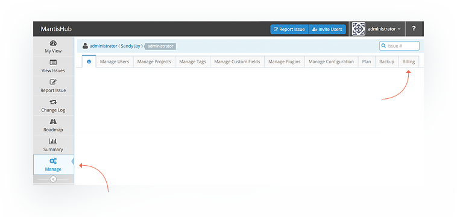

# How to Log In to Your MantisHub and Billing Interface

As users signup for their MantisHub, they are often not sure about how to log in for the first time to access the service.  At sign-up you will have:

1. Nominated a **name** for your MantisHub (e.g. greatsoftware),

2. Provided an **email address** and 

3. Provided a **password**

Assuming that your MantisHub is named "`greatsoftware`" you will need to browse to:

`https://greatsoftware.mantishub.io`

To log-in, your username will be **administrator** and the password will be the one you created at sign up. 

To manage your account (plan, contact details, payment method etc) there will be a '*Billing*' tab available from the '*Manage*' page within your MantisHub. This will take you to your billing portal.

This tab will be accessible to all Administrator [user accounts](/user_management/create_user_accounts). From the billing portal, you will be able to make all account changes such as [adding or updating payment details](/plans_billing/adding), [change plans](/plans_billing/switching) or [cancelling your service](/plans_billing/closing). 

 

You can also access your MantisHub using [single sign-on](/plug_ins/config_authhub) with supported vendor accounts.

 

So now that you're in, check out our [video](https://youtu.be/n0xy4ED51DI) on how to get started.