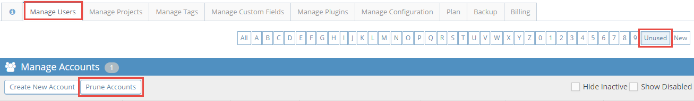

# Pruning User Accounts

Pruning user accounts allows bulk deletion of user accounts where:

- The user has not logged in since creation,
- Creation happened more than 7 days ago, and
- The account is not marked as 'Protected'.

This is particularly useful for when self signup is enabled or accounts where users signed up with an invalid email or with a typo in their email address or an additional account was created. 

**Note**: This process deletes accounts and is **PERMANENT**. If you have [group/team user accounts](/project_management/auto_assign_issues) that tickets are assigned to please verify before pruning and consider marking such accounts as 'Protected' in the user configuration. If you are unsure whether the account is being used consider [disabling the account](/user_management/disable_accounts) instead. 

Administrators can prune accounts by going to “Manage”, “Manage Users”, selecting 'Unused' from the filter options and clicking the “Prune Accounts” button.

