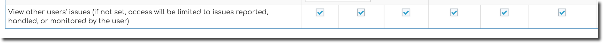
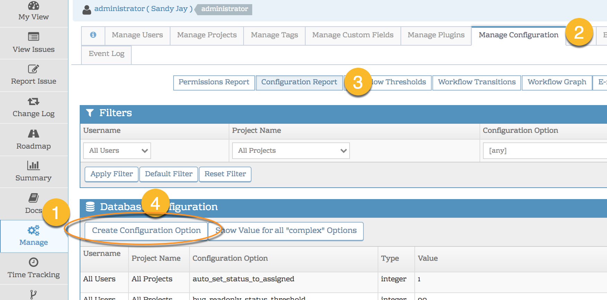

# Restricting User Access to Issues

There are many use cases within MantisHub where you may want to restrict user access to certain issues. You may be using MantisHub to service several different customers and need segregation of issues so they don't see each other's tickets. You may want to communicate with the dev team on an issue without the reporter seeing details or you may wish to prevent reporters from taking further action on the ticket beyond reporting it.  Whatever your use case,  There are a few ways to restrict access in MantisHub:

**Public vs Private Projects, Issues & Notes**

The first thing you should look at is making [projects](/project_management/create_projects) public or private. Public projects are available to all your users but private projects need you to specifically add users that need to access these projects. You can even set your projects to be [private by default](/project_management/projects_private) if this will be your typical setup.

If you need to restrict access to specific issues, you can set an [issues 'view status' to be private](/issue_management/public_vs_private_issues).  As with projects, you can also set the [default issue view status](/issue_management/privating_issues) to be private. Within Mantis, there is a natural demarcation point with user access levels which differentiates what we call 'team members' vs 'reporters'. Team members usually work toward actioning tasks or issues and have greater functional access as well as the ability to handle or be assigned tasks. These access levels are *developer, manager or administrator*. Reporters are generally your consumers or customers/clients and are access levels *viewer, reporter or updater* and have limited functional access to an issue as their access level names suggest.  The private view status uses this demarcation, and by default, only developers and above can view private issues. There is however a configuration option that will allow you to amend this natural threshold if absolutely necessary to your workflow.

**Config Option**: private_bug_threshold

**Value**: <minimum access level to view private notes. e.g. 'developer' etc>

At times you may wish to make restrictions even more granular to the issue note level. For example, it may be useful for developers to collaborate within a reported issue without the reporter viewing developer comments. To set a note as private, there is a checkbox within the notes section that you just need to check. Private notes are viewable by team members with access to the issue. Again, this is customizable with a configuration option: **private_bugnote_threshold**. As with private issues, issues notes can be set to [private by default](/issue_management/privating_issues).

**Configure Users to View Only Their Own Issues**

The second way to enforce more stringent restrictions to user access is using the [workflow thresholds](/customizations/wf_thres) option to limit users to view only their related issues. You can apply this configuration via the [Workflow Threshold](/customizations/wf_thres) UI (see image below) and it restricts access according to user access levels. E.g. you would prevent all reporters and/or all updaters etc. This will restrict a users access to only the issues they are involved in. i.e. issues they have reported, are handling or those issues where they have been added to be monitoring. 

Within the UI, it's just a checkbox so check all access levels you would like to have open access. Access is still subject of course, to the public/private settings of your projects and issues etc. 

By default, this is set to ANYBODY which means everyone can view issues if they have access to the project/issue. 

You can set this for all projects or just for one or more specific projects using the [project selector](/project_management/project_selector) within the workflow threshold page. 

**Troubleshooting Note**: This option is replacing the older deprecated "limit_reporters" configuration option. During the transition period, if you have this older configuration set then this threshold will not take effect, so make sure this configuration is removed in the 'Manage - Manage Configuration -Configuration Report' page. 

**Thresholds & Transitions**

You can further control certain specific actions (e.g. re-opening an issue, adding a note, updating status etc) according to access level, including the option to limit users to their 'own' issues. through the workflow thresholds. Check out this article on [Workflow Thresholds](/customizations/wf_thres) here for more details. 

**How to create a configuration option**

To create configuration options, you need to head to Manage - Manage Configuration and click the Configuration Report button. Then click the Create config button. 

Note that administrators can always test a users access to projects and issues using the [Impersonate](/user_management/imperson_users) function. Read [here](/user_management/imperson_users) for more details. This is recommended to ensure you have securely set your permissions. 