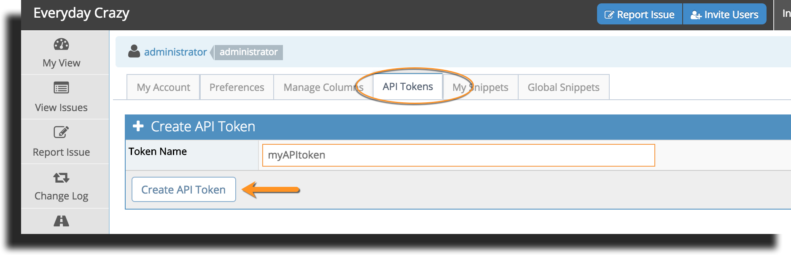
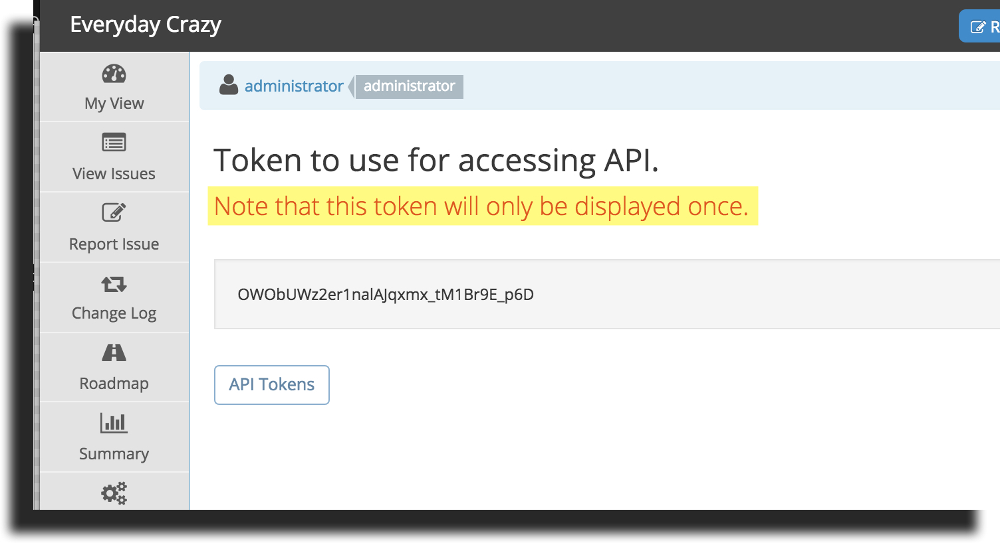

# Connecting to MantisHub APIs Using API Tokens

API tokens provide users with more control, convenience, visibility and security when providing other services and apps access to their MantisHub.

Here are some of the benefits of API tokens compared to use of passwords:

- Tokens are 32 characters long and cryptographically secure, hence, they are much more secure than user passwords.
- Tokens are generated by MantisHub, hence, they are not going to be shared passwords with any other internet services that the users use.
- Users have visibility on when each token was last used to access MantisHub.
- Users can revoke one of the tokens without impacting others.  Hence, can selectively deny access to specific services.
- Users can change their passwords without affecting the validity of the API tokens.

The tokens are only displayed once and should be used for one integration.  The tokens can be passed in the password field when calling the [MantisHub APIs](/api/mh_rest_api).  Note that it can’t be used to login via the MantisHub login page.

Here is how to create API tokens:

Log into your MantisHub (or as an administrator [impersonate](/user_management/imperson_users) the account to create a token for), click on your username in the top right hand corner and select "My Account" from the drop down list. Then click on the "API Tokens" tab. Type in a descriptive name for the token and click "Create API Token".

Copy and save the generated token. Be sure not to lose it as it will **only displayed this one time**. If you do mis-place it, you will need to revoke it and generate a new token.

