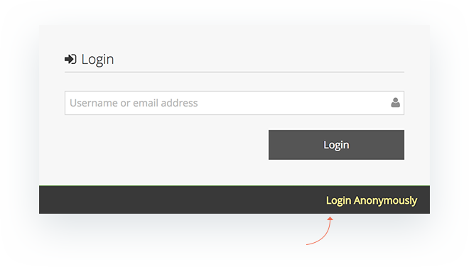
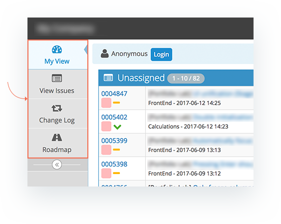
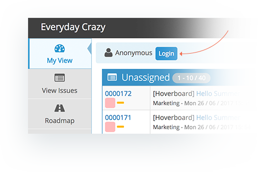

# Setting up Anonymous Access

MantisHub supports enabling read-only access for anonymous users. This model is useful when you have a large number of customers/stakeholders that you would like to view the Changelog and Roadmap. It also enable users to browse your issues without having to create an account first. However, if users are going to report issues or comment on issues, they are required to have an account with reporter access.

Anonymous access also enables search engines to index your MantisHub issues.

Following are the steps to enable anonymous access:

1. Create user 'anonymous' with VIEWER access and any valid email address.  This will grant the anonymous user VIEWER access to all public projects. Note that the 'anonymous' user account is case-sensitive so the username should be lowercase.  
2. Mark the user as 'protected'.  This makes sure that users that are anonymous are not able to change profile information for user 'anonymous'.
3. To enable anonymous access to private projects (typically doesn't make sense), go to Manage, Manage Projects, [Project Name], and grant user VIEWER access.
4. Contact MantisHub support to enable the Anonymous Access feature for your instance.  Note that this requires a paid plan.

Once Anonymous Access has been enabled for your MantisHub simply provide your MantisHub URL to anyone you wish to have access. When they land on the login screen they can select 'Login Anonymously'.

Anonymous users will be have VIEWER access which means they will be able to view public projects and issues as well as see the Changelog and Roadmap.

If an anonymous user has a registered account and wants to login with their credentials for higher level access there is a 'Login' button on the top left-hand side of the screen.

Often along with anonymous access it is desirable to [enable users to signup and get reporter accounts](/customizations/allow_signup).