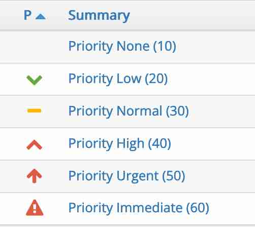

# Customizing Field Values

Customers on a paid plan can customize many facets of MantisHub.

The most popular is issue status, see our article on [Customizing Issues Status](/customizations/issue_stat) for details on how to do this. Other issue fields you can customize include:

- **severity**,
- **priority**,  and
- **reproducibility**

Project fields can also be customized such as project **status**. You can also add entirely new custom fields to your project, see [Adding Custom Fields](/customizations/custom_fields) for details on how to do this. 

To customize these, simply contact our support team and include the following information in a word/excel/pdf document:

1. Field you wish to customize.
2. The **name** of the new field value in English and in any other language you need it in. Choose from our [list of supported languages](https://github.com/mantisbt/mantisbt/tree/master/lang).
3. The field value **order** within the existing values from lowest to highest. This is best displayed as a number in reference to the current value code. See the relevant table below for a list of existing field values and their codes so you can nominate an appropriate order in relation to the existing values.

*For example*: If you need to add a new **priority** value with **name** 'escalating' and you want to have it appear between 'high' and 'urgent', you can give it an **order** of 45 and email this name and order to support to have it added.

Note: In the case of **priority**, icons are visible on the View Issues screen. These icons are linked to the order code and cannot be modified. You will want to keep priority listed from the lowest 10 to the highest 60. You are welcome to change the name or remove priorities you do not need, but if you reverse this and make your highest priority 10 the icons will not match.

Lastly, if you'd like to remove a field value entirely, please make sure you have no issues in your system with this field value set before sending in your request. You can [filter](/filters/using_filters) on this and change the values). If you do leave issues with this value, once we remove it for you, you will have an invalid value in your issue (something like '@10@') and you will no longer be able to filter on this. 

**Field Values and Codes**

