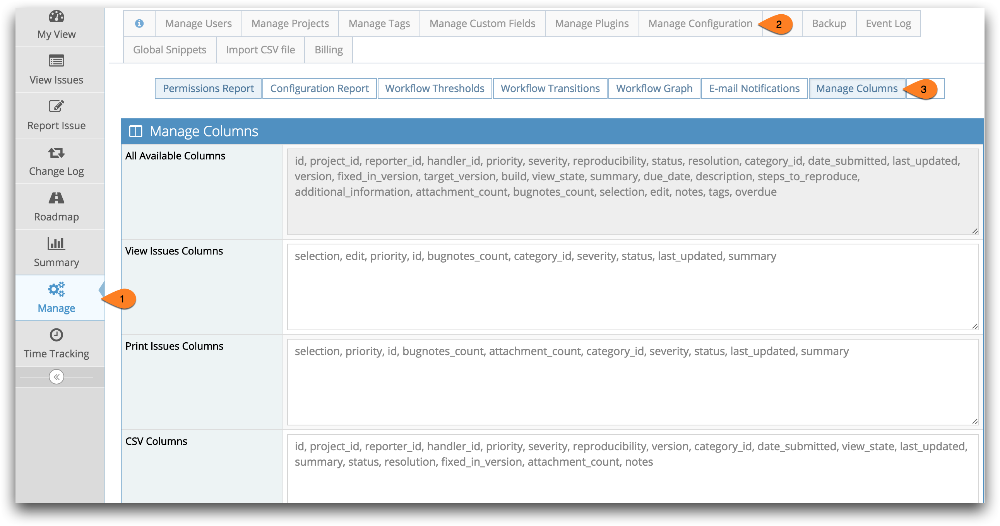
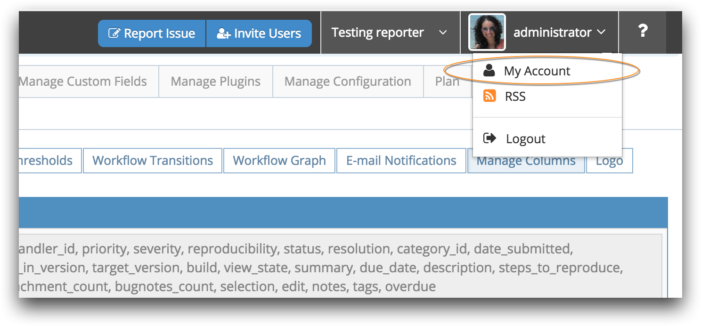

# Managing Column Views for View/Print/Export Issues

Administrators can customize the default columns displayed for all users. Default columns can be configured for the View Issues page, the Print Issues page and for CSV and Excel exports.

To set these columns head to Manage - Manage Configuration and click Manage Columns.

Make sure your have your [project selector](/project_management/project_selector) set correctly to reflect where these settings will apply e.g. "All Projects" or for just a specific project.  The settings for "All Projects" is used as the default, when a project doesn't have explicit settings for displayed columns.

Select which columns to show in each of the different views from the options listed in the 'All Available Columns' box. This controls what is visible and in which order.

User with any access level can also set their column view in their personal account settings by heading to 'My Account' in the drop down box under their username in the top right corner of the screen.

Custom fields are also added the the available columns list. If a custom field is named "foo", the field name will show as "custom_foo".  Always reference the supported column names from the 'All Available Columns' text box.

You should treat field names as case sensitive.