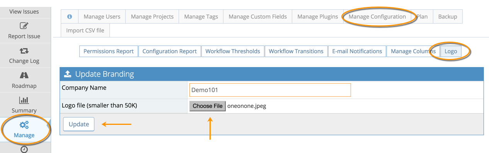

# Personalizing MantisHub with Company Name and Logo

[Video Tutorial](https://youtu.be/1Spt0YoTdmw)

<iframe width="560" height="315" src="https://www.youtube.com/embed/1Spt0YoTdmw?si=qoGKxT3bnJVSUDEf" title="YouTube video player" frameborder="0" allow="accelerometer; autoplay; clipboard-write; encrypted-media; gyroscope; picture-in-picture; web-share" referrerpolicy="strict-origin-when-cross-origin" allowfullscreen></iframe>

MantisHub enables administrators to personalize it with their company name and logo. The logo will be displayed on the login page and the company name will be on the header of the screen after login.  It will also be used as part of the window title.

To customize it:

1. Prepare a PNG file for the logo that is smaller than 50K and has a height of no more than 80 pixels.
2. Click "Manage" menu
3. Click "Manage Configuration" menu
4. Click "Logo" menu
5. Enter the name you want displayed in the Company Name field. 
6. Upload your logo from there. If the logo doesn’t update right away, click the browser refresh button.

