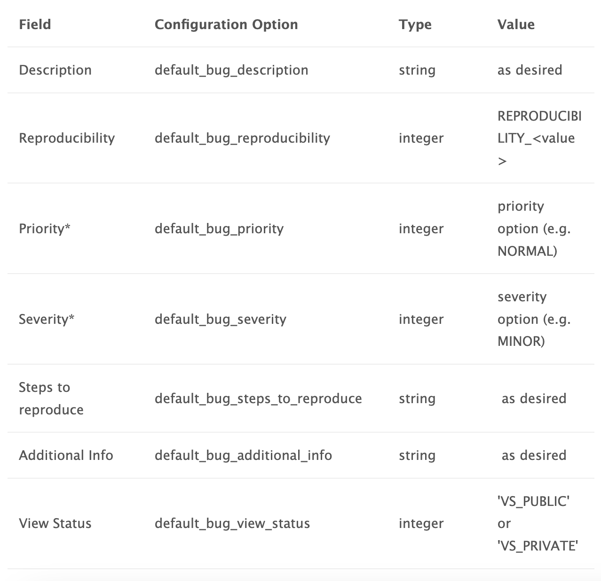
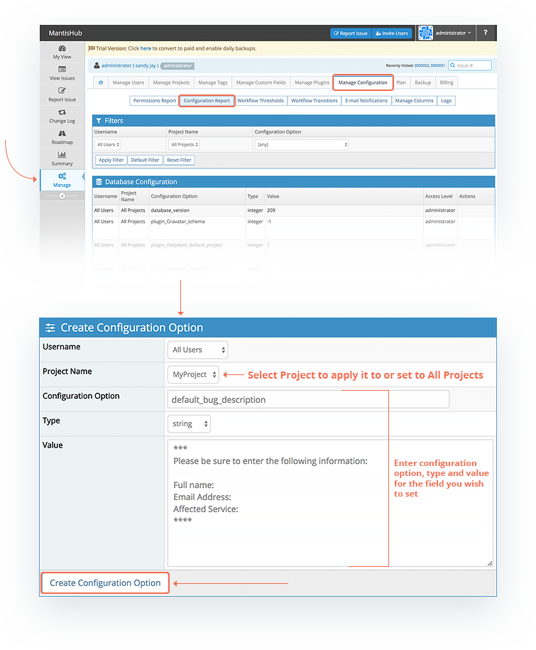

# Setting Default Values for Issue Details

There are options available to allow you to set default values for issue fields. There are 2 types of fields within MantisHub, there are native fields and you can also create custom fields for any added information you want included in your issues. 

**Custom Fields**

For custom fields it's very simple to set a default value. Within the custom field configuration there is a option for this. Check out the article [Adding Custom Fields](/customizations/custom_fields) for step by step instructions. Just note that this default value will be applied to all projects that are linked to this custom field.

**Native fields**
For some native fields you can create a configuration option to set a default value. 

Just head to the 'Manage' - 'Manage Configuration' page and click the 'Configuration Report' button. 

* Scroll down to 'Create Configuration Option'
* This can be set for either all projects or just a specific project.
* Enter configuration option (e.g. 'default_bug_description')
* Enter the correct Type for the configuration option listed below (e.g. string)
* Enter the value that you want to pre-populate in the relevant field. (e.g "please enter description of the issue...")

Default values can be set for the following fields: 

*`*`NB: for priority and severity there is already a default option set of NORMAL and MINOR respectively. You would only use this configuration option if you want to override these system defaults.*

For multi-line fields like description, steps to reproduce and additional information, a popular use case for default values is to provide a template that reporters can fill in.  This often significantly improves the quality of the issue report, reduces discussion round trips and hence time to resolve the issue.