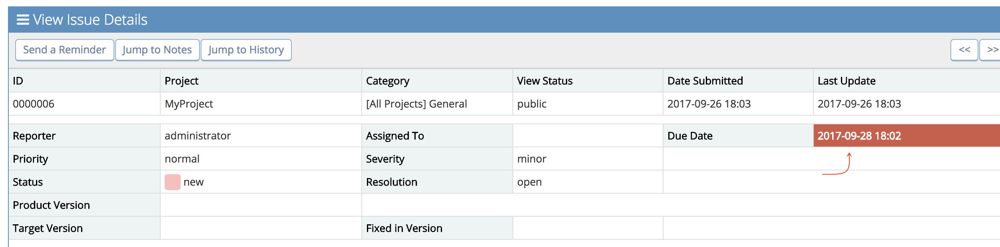
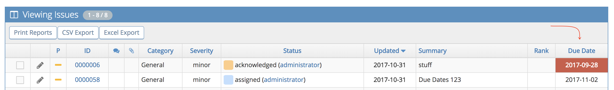

# Enabling and Configuring 'Due Date' Tracking

The 'Due Date' functionality allows users to include information and set goals for their ticket SLAs. This can help with prioritizing issues and tracking milestones. When enabled, each ticket will include a 'Due Date' field which can be populated manually or set with a configured default.

The due date field will also display color warning levels if the ticket is still in an open status, i.e. not resolved or closed, as it approaches or passes the set due date. You can also export the 'Due Date' information for reporting purposes. 

**How to turn on Due Date tracking**

To enable the Due Date functionality you will need to allow users to 'update' AND 'view' the due date field by adding 2 new configuration options.

You can choose to have the 'update' and 'view' access levels be the same but you need both configurations to be created for the 'Due Date' field to be both visible and editable. Once the View Due Date configuration has been added, only users with 'view' or 'update' access will be able to see the field in the ticket or the date entered and only a user with 'update' access will be able to edit the field.

To add the configuration options, go to 'Manage' - 'Manage Configuration' - 'Configuration Report' page and scroll to the 'Create Configuration Option' section:

**1. 'Update' Due Date Configuration:**

You will need to add the following setting to make Due Date available when reporting an issue and set the access levels allowed to update the field. 

***Configuration Option:*** 'due_date_update_threshold'

***Value***: < minumum access level allowed to update the due date field > (e.g. 55 = Developer so any user with Developer access level or higher will be able to update the Due Date field. See the access level article for all available access levels.)

Click 'Create Configuration Option'.

**2. 'View' Due Date Configuration:**

This setting will define which access levels can view due date for issues. 

***Configuration Option:*** 'due_date_view_threshold'

***Value***:  < minumum access level allowed to update the due date field >  (e.g. 10 = VIEWER so any user with Viewer access level or higher will be able to view Due Date field. See the [access level](/customizations/access_levels) article for all available access levels)

Click 'Create Configuration Option'.

**Configuring Due Date tracking**

If this fits in with your workflow, you also have configuration options to set a due date default value. All new tickets will populate a default due date entered based on this parameter. However, a user with update access can modify the default due date.  

**1. Create a default due date:**

This will automatically populate the due date field on issue creation.  You can set this as a fixed date or a date relative to the issues creation date (e.g. +1 week). To set this up, you will need to add the following configuration. 

***Configuration Option:*** 'due_date_default'

***Value***: < accepts an actual date or can be a relative date. See [format definition documentation](http://php.net/manual/en/function.strtotime.php). for supported values > (E.g. 'today' or '+2 days')

Hit 'Create Configuration Option'.

**2. Due Date Warning levels**

MantisHub allows you to define 3 warning levels as your issue approaches its due date. As you issue hits each of these warning levels, your Due date field will be highlighted. *RED* for level 0, *ORANGE* for level 1 and *GREEN* for level 2.

By default, there are 2 warning levels defined. The first will trigger immediately once the Due Date has passed (0 seconds before) and the ticket remains unresolved. As per above, the warning consists of highlighting the Due Date field RED. The second default level is 7 days prior to (604800 seconds before) the due date and this will turn the due date field ORANGE. 

To change or define due-date warning levels use the configuration option below:

***Configuration Option:*** due_date_warning_levels

***Type***: complex 

***Value***:  array(< level0 warning >, < level 1 warning in seconds>, < level 2 - warning>) 

Warnings are defined as seconds before the due date. Use negative value if you wish the warning to happen after the due date has passed. Some examples:

Note that as soon as the issue is resolved or closed, any warnings will disappear.

**Exporting Due Date**

Lastly, if you want to see the export the new 'Due Date' field or see in your 'View Issues' screen, check out this article for details on how to add this field to you exports: [Managing Column Views for View/Print/Export Issues](/customizations/column_views). Exporting this information, along with 'Updated' field (date of the last issue update, typically issue closure date) this will allow you to run your own analytical tools and queries on how your team has met their set SLAs

Add the 'Due Date' field to global settings for the 'View Issues' columns, and as long as a users personal Columns preferences do not exclude it, users will see the Due Date column. However, only users with the relevant view or update permissions will see the date populated in it. Everyone else will see the column empty.