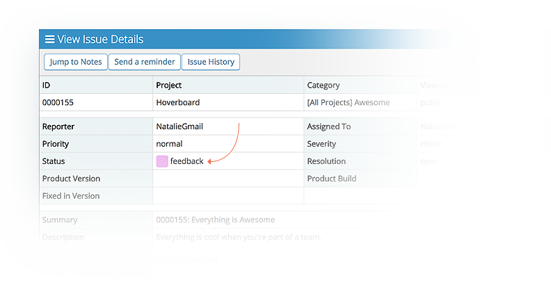
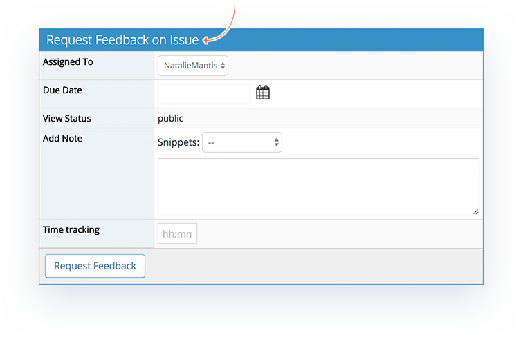
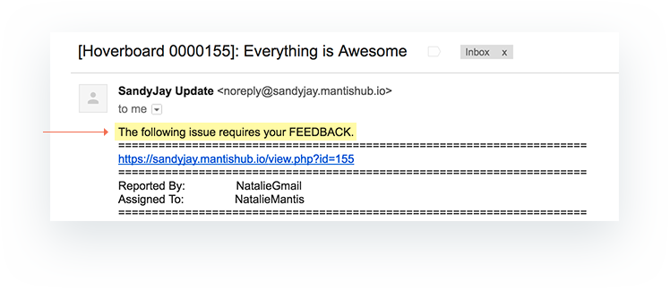

# Customizing Issue Statuses

Often administrators like to customize the statuses in MantisHub to match their workflow. You can add, modify, or remove statuses by emailing our support team with the information below. All status changes apply globally to your MantisHub. We do not support status changes at a project level. Feel free to use the sample document provided at the end of this article to add new statuses or to modify existing statuses.

**New Status**

Email the following details to support for new statuses (See example document at the end of this article):

**1. Name**- This is the name of the new status e.g. 'Tested'.

2. Title - This indicates the title of the screen users see when confirming a status change during their normal workflow e.g. 'Moving issue to Test'.

**3. Action** - This is the description of what has occurred which will appear in the email notification to the reporter and others that are notified on status changes e.g. 'Issue is now being TESTED'.

**4. Color** - This is the color of the square that appears along with the name of the status.  Use [w3 schools color picker](https://www.w3schools.com/colors/colors_picker.asp) to select the color and provide us with the Hex number. Make sure you compare it to the existing status colors (See [Status Codes & Colors](/customizations/stat_colors)) to ensure they are not too similar.

**5. Status Order Code** - This is the numeric order of the statuses in reference to one another. See default status order codes ([Status Codes & Colors](/customizations/stat_colors)). This must be unique. An existing status order code cannot be used for a new status.

Example: A new status 'Tested' that should be after ‘Assigned' (Order Code: 50) but before ‘Resolved' (Order Code: 80) could be given Order Code: 65. 

You can choose any order code that is not being used but the order specified is important and should be consistent with your workflow because it will impact reporting, filters and thresholds. For example anything with a code of *80 or higher* is reported on as ‘Resolved' and anything with a code of *90 or higher* is considered ‘Closed' and hidden by default.

Additionally, if you are using or are planning to use the '[Helpdesk-Report Issues via email](/mantishub_helpdesk/report_email)' functionality it is important to note that there is code tied to the **Feedback** (20) and **Assigned** (50) statuses so we strongly recommend against removing or modifying these statuses. If a ticket is created via email and moved to 'Feedback' (or status code 20 even if it's not called Feedback) because you need more information from a customer, when the customer responds via email the ticket will automatically move to 'Assigned' (or status code 50 even if it's not called Assigned).

**Modify an existing status**

Provide the following details to support (See example document at the bottom of this page):

1. **Name** - Provide the name of the old status and what the name of the new status should be.
2. **Title** - Provide the new title for the screen users see when confirming a status change.
3. **Action** - Provide a new description of what has occurred which will appear in the email notification to the reporter and others that are notified on status changes.

**Color** or **Order** can be modified upon request but is not required. If they are not specified the color and order will remain the same.

**Remove/Hide an existing status**

Customers can also request to remove/hide any of the status options by contacting the support team with the statuses they would like removed. **We strongly suggest that ‘Resolved’ and ‘Closed’ statuses are not removed or modified.**  An alternative to removing ‘Resolved’ is to modify the [resolution values](/issue_management/combs_status_resol). 

Prior to requesting a status be removed the customer should validate that no issues are currently assigned to those statuses. Once the status has been removed an error will appear when an issue in an ‘old’ status is opened. Also the ‘old’ status is not searchable, it is problematic to change these after the fact. 

**Language**

All information except for Status Order Code and Color need to be provided to the support team in English as well as any other language in which it needs to be displayed. This is for both new statuses and modifying of existing statuses. For a list of the available languages, refer to https://github.com/mantisbt/mantisbt/tree/master/lang.

