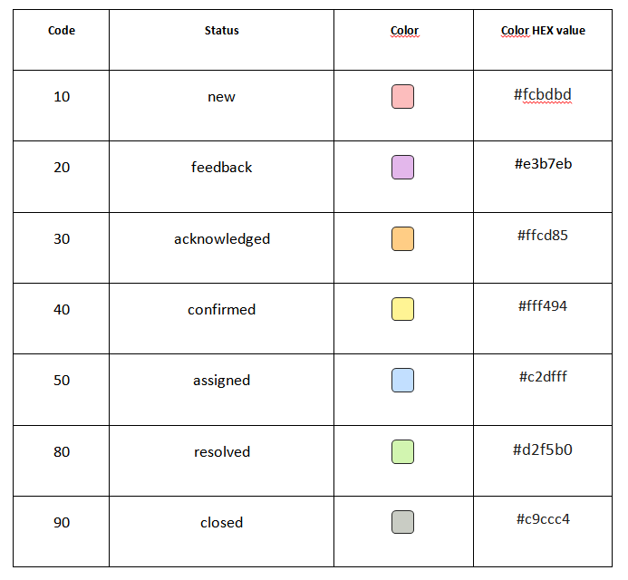
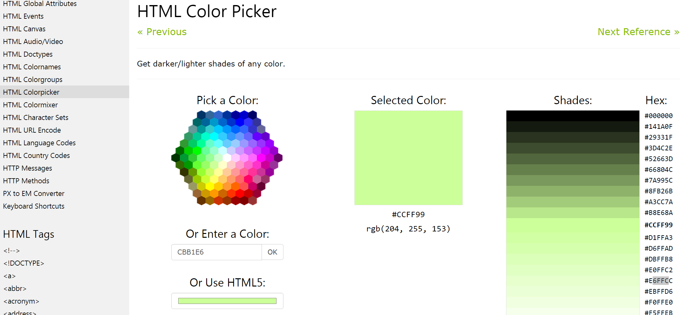

# Status Codes & Colors

The default system issue statuses listed in the table below, are mapped to an internal code and also to a color. For customers wishing to add customized statuses, a code and color will need to be selected for new status values. See [Customizing Issue Statuses](/customizations/issue_stat) to find out more about this process. Also check out [Issue Lifecycle](/issue_management/issue_lifecycle) to read about the default system issues status values and workflow.

**Codes**

Any new customized issue status codes should be interleaved within the default status code values.  For example, statuses with code equal or greater to 80 means the issue is resolved, so if adding a status that should be treated as resolved, then it should have a code higher than 80.

If you remove or change a status code please note that this will not change the existing issues. Issues may end up with a code value that is not associated with a status. For example, if a 'testing' status previously had a value of 65 and was changed to be 60 or removed it, all issues that were assigned to status 'testing' will now display status '@65@'.

**Color**

The color associated with new status value should be selected from [w3schools color picker](http://www.w3schools.com/colors/colors_picker.asp) and should not be too similar to the existing colors used.

In the modern UI, this is displayed in a box next to the status name when viewing issue lists. In the classic UI, the color is used as the background color when displaying issues.

When choosing the colors, choose lighter colors that works well as background color for black text.