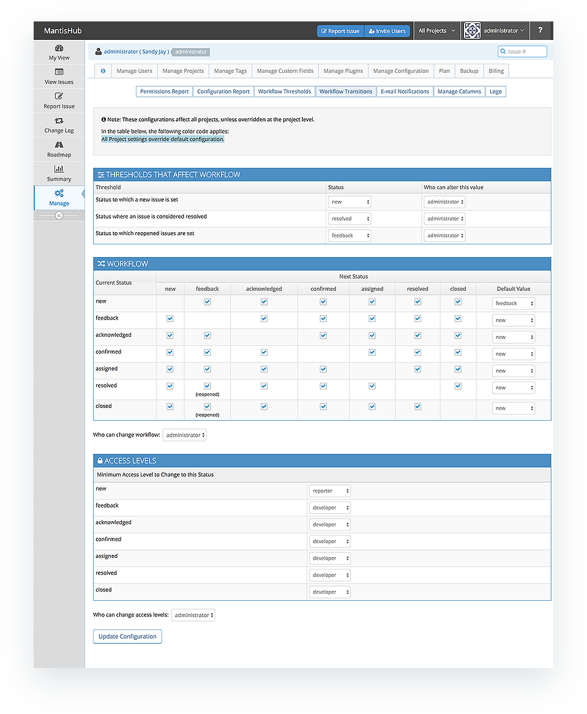
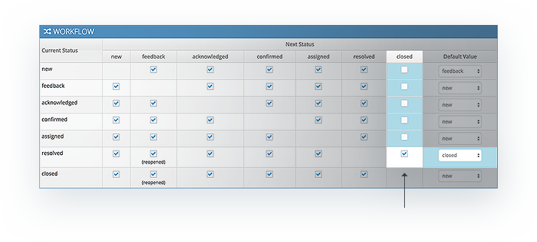
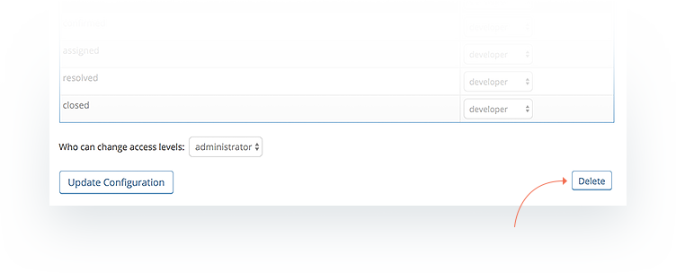

# Workflow Transitions

Workflow transitions relate to the [issue life-cycle](/issue_management/issue_lifecycle) and how your issues transition from one status to another. They allow you to further control the change of status process. By default, issue transition from any state to another is permitted as shown below, however you may want to make sure there is a set flow of an issue and through specific states and lock these down.

To change these permissions, head to Manage - *Manage Configuration and select the Worfklow Transitions* tab. Check and uncheck box boxes as needed to address your requirements. As with [workflow thresholds](/customizations/wf_thres) you need to take note of the [project selector](/project_management/project_selector) when making changes here as it indicates which projects the displayed settings relate to. 

You can control:

- Status thresholds relating to workflow e.g. status to which a new issue is set. 
- The status transitions from or to specific states,
- The default value shown when changing status depending on the current status, 
- The minumum access level allowed to change to a certain status, and
- What access level is allowed to make changes to the workflow settings. By default this is the administrator only.

For example perhaps you want to make sure an issue is resolved before being closed and the default value when changing from 'resolved' state is 'closed', then you would only allow a transition from resolved to closed and uncheck boxes allowing the transition from any other status as per the below screenshot. Note that because these values have been changed from the default for all projects, the settings are highlighted blue. For changes made for a specific project, the differences from the default or all project setting will be shown in green.  

At anytime, you can revert back to default settings by click the 'Delete' button at the bottom of the page for the relevant project, so don't forget to check what your [project selector](/project_management/project_selector) is set to so the correct setting is deleted. 

