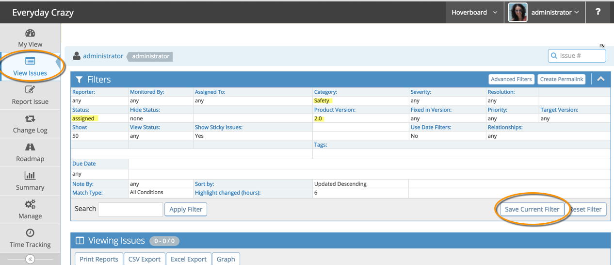
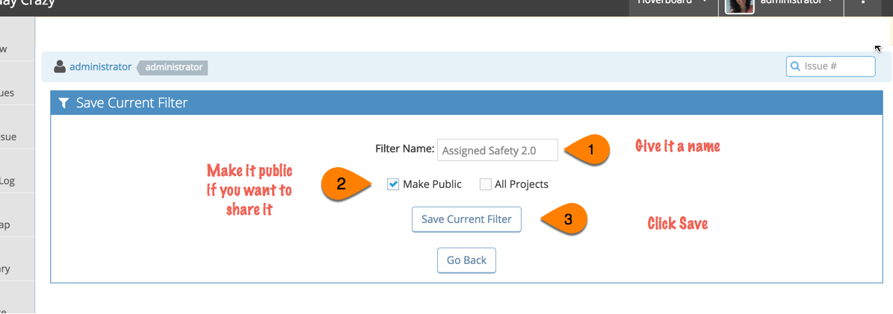
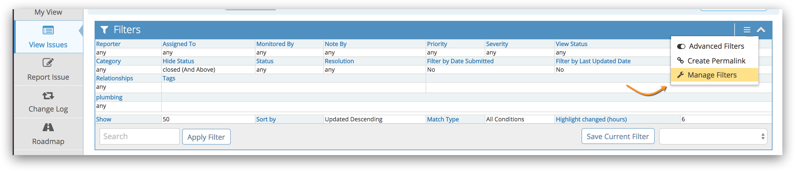
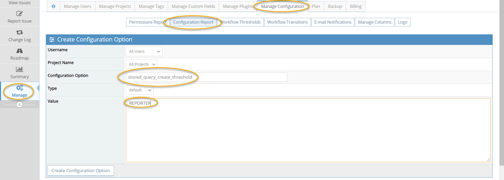

# Saving and Sharing Filters

[Video Tutorial](https://www.youtube.com/watch?v=Cg3-wNYRsDo)

<iframe width="560" height="315" src="https://www.youtube.com/embed/Cg3-wNYRsDo?si=pYtxZEisyNSGDkNE" title="YouTube video player" frameborder="0" allow="accelerometer; autoplay; clipboard-write; encrypted-media; gyroscope; picture-in-picture; web-share" referrerpolicy="strict-origin-when-cross-origin" allowfullscreen></iframe>

By default, MantisHub stores the latest adhoc filter per project. So that users retain their latest filters between login sessions, or as they switch between projects.

However, it is often useful to save filters so that the user is able to easily switch between them. You can also share these filters so other team members can make use of the same filter.

**Creating a saved filter**

- Go to View Issues page
- Select the project you want to apply the filter (from [project selector](/project_management/project_selector), on top right corner).
- Select the filter criteria
- Click 'Apply Filter'
- Verified that issues listed match the desired criteria
- Click the "Save" button.

Then...

- Provide a name for the filter. 
- Check 'All projects' if you want to make the filter available across all projects - e.g. "assigned to me" filter would make sense to make available independent of the selected project. If unchecked it will only be available in the project listed in the project filter.
- Check 'Make Public' if you want to make the filter available to all users - e.g. "Release 2.0 Blocking Issues" make sense to share across all users on a specific project.
- Click "Save Current Filter"

**Navigating between filters**
- Select the filter name from the dropdown next to the 'Load' button to change filters.
- Click the 'Reset' button to restore default filter values (i.e. all issues belonging to set project that are not closed).

You can manage (edit and delete) your saved filters by heading to the View Issues page and clicking on the menu in the top right of the filter box. If you have saved filters, you will see a 'Manage Filters' option. 

**Filter Configurations**

Permission to use, save, and share a filter can be modified with configuration options. You do not need to modify the user's access.

Here are the config options and the default settings:

- Threshold needed to be able to USE filters:
*`stored_query_use_threshold`* = REPORTER
- Threshold needed to be able to CREATE filters:
*`stored_query_create_threshold`* = DEVELOPER
- Threshold needed to be able to CREATE SHARED filters:
*`stored_query_create_shared_threshold`* = MANAGER

To add a configuration option, go to 'Manage' - 'Manage Configuration' - 'Configuration Report' page and scroll to the 'Create Configuration Option' section:

Example:

**Configuration Option**: stored_query_create_threshold

**Value**: `<minimum access level allowed to create a filter>` (e.g. 25 = REPORTER) so any user with Reporter access level or higher will be able to create a filter. See the [access level article](/customizations/access_levels) for all available access levels. You can either write the name or the numeric value in the 'Value' section).

Click 'Create Configuration Option'.

