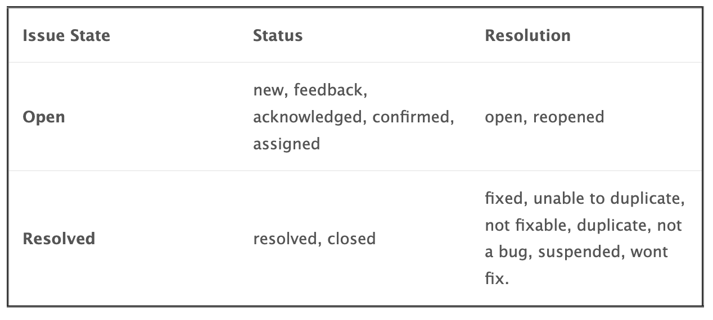

# Valid Combinations of Status and Resolution

There are two related fields that reflects the status of an issue.  These are the "status" and the "resolution" fields.  The role of these fields is:

- **Status** - The overall status of the issue.  It has a set of statuses that indicate that the issue is not started or in progress and others that reflect that the issue work is complete (aka resolved).
- **Resolution** - Mainly useful when the issue work is completed.  An issue can be complete with issue resolution reflecting that the issue is resolved, or it wasn't possible to reproduce it, etc.

For reference, here are the possible values for both fields:

- Status: 10:new, 20:feedback, 30:acknowledged, 40:confirmed, 50:assigned, **80:resolved, 90:closed**
- Resolution: 10:open, **20:fixed**, 30:reopened, **40:unable to duplicate**, **50:not fixable, 60:duplicate, 70:not a bug, 80:suspended, 90:wont fix**
The bold statuses reflect resolved issues and the bold resolutions reflect values that can be associated with a resolved issue.

By default re-opened issues go to "feedback" status and "re-opened" resolution.

If the user attempts to mix a resolved status with a resolution like "opened" or a non-resolved status with a resolution like fixed, then MantisHub will prompt an error message like: Resolution "fixed" is not allowed for status "acknowledged".

To re-cap here are the valid combinations:

