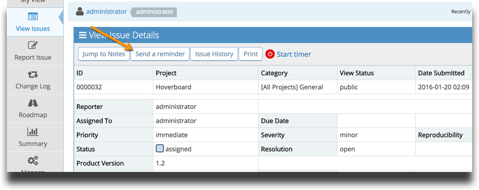
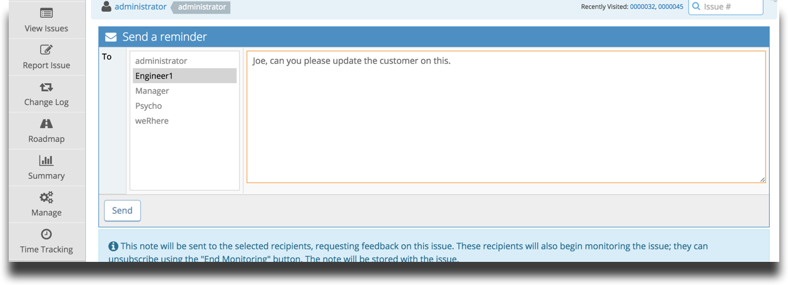
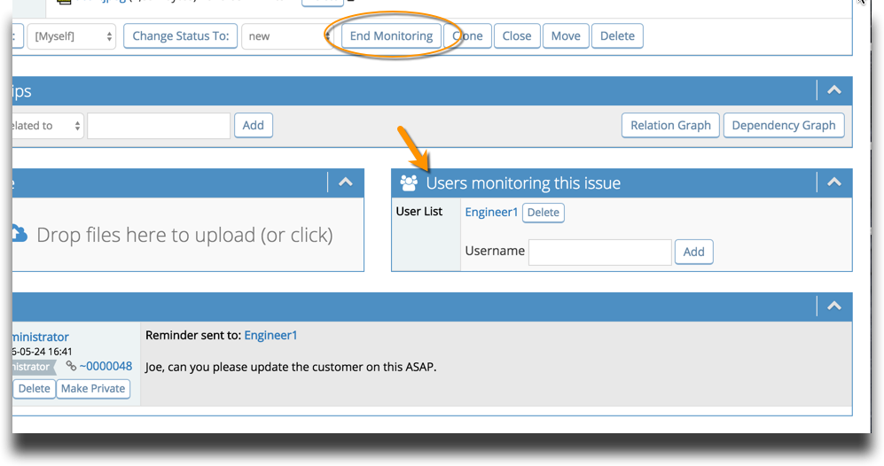

# Issue Reminders

You may wish to call attention to a particular issue. Maybe you want to remind Joe that he needs to update an issue, or you have a relevant question you want Sarah to answer in relation to the issue. MantisHub generally recommend making use of [@ mentions](/issue_management/mention_notifications) but you also have the option to send a reminder. 

At the top of your issues, you'll see there is a 'Send a reminder' button.

   
You can simply write up a message and select the users you wish to receive the reminder. The users will be emailed the message and it will also be added to the issue as a note.

   

The users will also be set to monitor the issue and, depending on your [email notification](/issue_management/config_email_notifs) settings, they will be notified of any other updates to the issue. They can 'End Monitoring' by clicking the button or delete themselves from monitoring users list.

 

**Configuration Options**

1. Reminders are on by default and can be turned off with this configuration option

*All Projects, All Users, reminder_recipients_monitor_bug, integer, 0*

2. Reminders may only be sent to users with access level developer and above by default. You can amend this threshold with the following configuration option:

*All Projects, All Users, reminder_receive_threshold, integer, 55*

*55 is the access level for developers.  So in this case, users can only remind those with access level DEVELOPER+.  See list of [access levels](/customizations/access_levels).* 

3.  You can also set the default view status (public or private) for reminders

*All Projects, All Users, default_reminder_view_status, integer, 10*

If reminders are set to private (10) or public (50).  The note created for the reminder is set accordingly as a private or public note.  Default is public.

