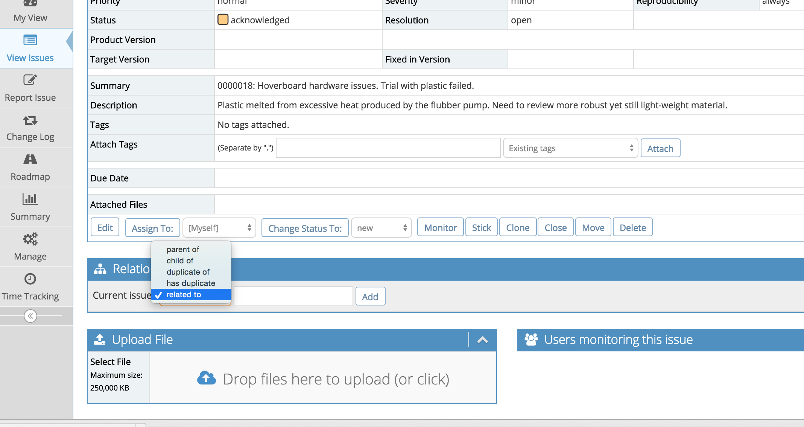
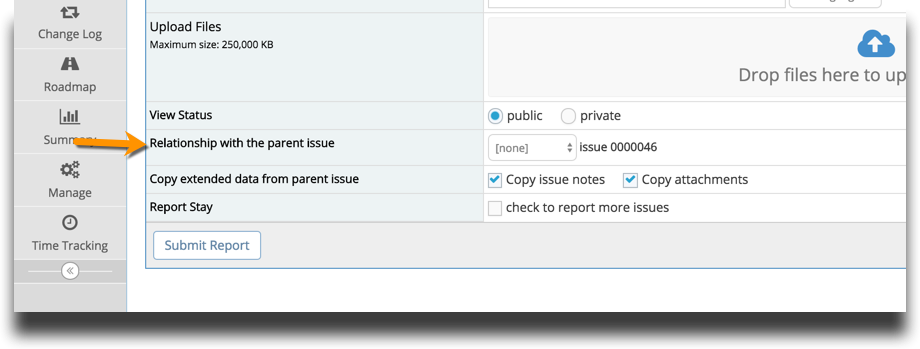
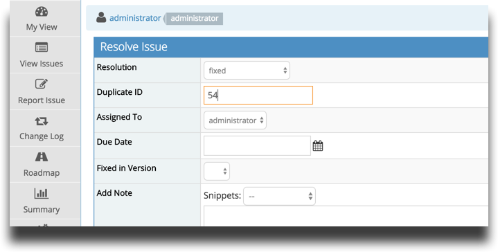
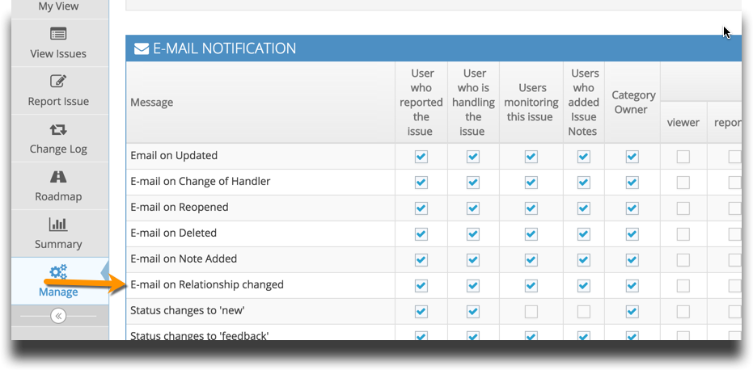
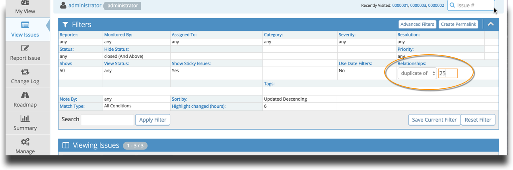
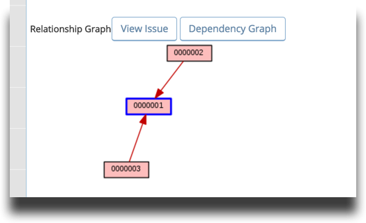
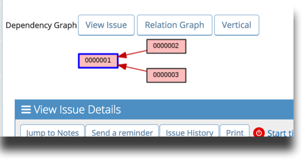

# Linking Issues Via Issue Relationships

Issue relationships link two issues together while specifying a relationship that links them together.  This is often used for scenarios like duplicate issues, related issues in same or different projects, and sub-tasks for an issue.

If you go into the View Issue page by clicking on an issue then scroll down, you will see a 'Relationship' section. This is where you can set a relationship between issues. Simply enter the issue ID that you wish to relate to and set a relationship. You can add a relationship for multiple issues at once using the '|' character in between issue IDs.

When you have relationships set, the issues are hyperlinked and listed with their relationship details and target issue statuses making it easy to navigate from one issue to the other.   

**Types of Relationships**

Relationships can be:

- 'parent of' - a parent issue requires that any children issues are resolved before it can be resolved.
- 'child of'  - must be resolved before a parent issue can be resolved.
- 'duplicate of',
- 'has duplicate', or 
- simply 'related to'.

**Other ways to set a Relationship**

When **cloning an issue**, you can set a relationship to the cloned issue on creation.  This is useful in scenarios like cloning an issue for a related project or cloning a help desk issue to create a product bug.

On **resolving an issue**, you can mark it as a duplicate of another issue which will automatically create a relationship between the two issues.

**Email Notifications**

Configure [email notifications](/issue_management/config_email_notifs) to trigger when adding relationships.

**Visibility**

Relationships are only visible to users who have access to both issues.

**Filtering**

You can searching on relationships via your View Issues filters. Specify the relationship and the issue ID to bring up the issues you need. For example, you may wish to search on any duplicates of issue 25.

 

**Relationship Graphs**

Relationship graphs draw a graph that illustrates any direct and indirect relationships to the issue being viewed. It can also graphically display any dependancies. To turn on this feature: 

Go to *Manage - Manage Configuration - Configuration Report* and add the following configuration.

*All Users, All Projects, relationship_graph_enable, integer, 1*

Here are examples of issue relationship and dependency graphs:

     

