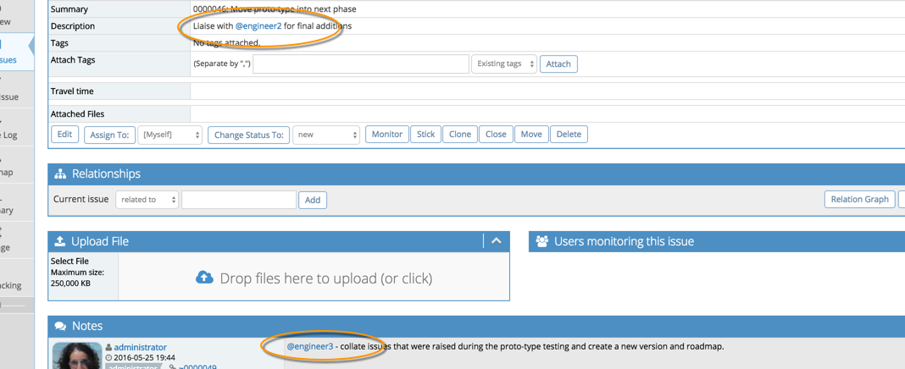
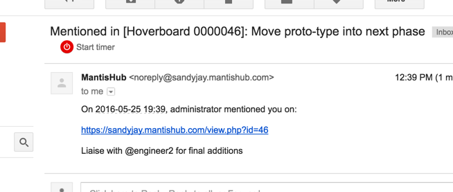

# @ Mentions for User Notifications

MantisHubs also now supports @ mentions as a way to capture a user's attention and make sure they are notified about your issue or note (even though otherwise they may or may not have received an email notification). 

They provide a simple way to draw someone's attention inline and are a standard approach that is used in other tools like github, twitter, and many others. Simply reference a colleague in an issue note or description and they will be emailed the note details with a link to the issue details.  

 

Users may receive the regular [email notification](/issue_management/config_email_notifs) as well as the @ mention notification. But @ mention notifications have a simplified format as well as a different subject which is handy when you have automated email filters on.

 

@ mentions are hyperlinked to user page and highlighted when notes/issues are formatted. 

For @ mentions to work for you team, you should follow these guidelines for usernames:

- Don't use email addresses as usernames.  Note that even if you use a snappy, short username, login with your email address will still work.
- Don't use spaces in user names.

There is also an option to [send reminders](/issue_management/issue_reminders) as an alternative to using @ mentions but there are restrictions on who can be sent reminders whilst @ mentions can be used for any user with access to the issue so @ mentions is the MantisHub recommendation.