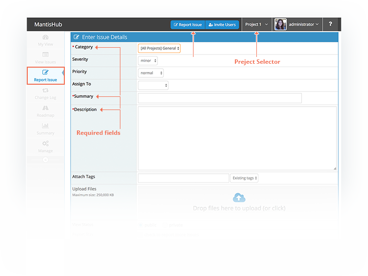
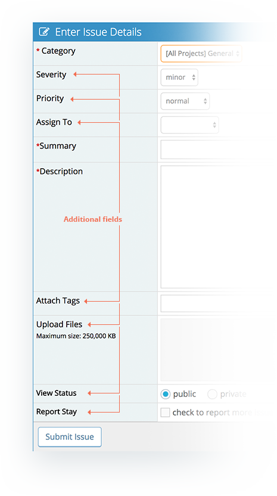
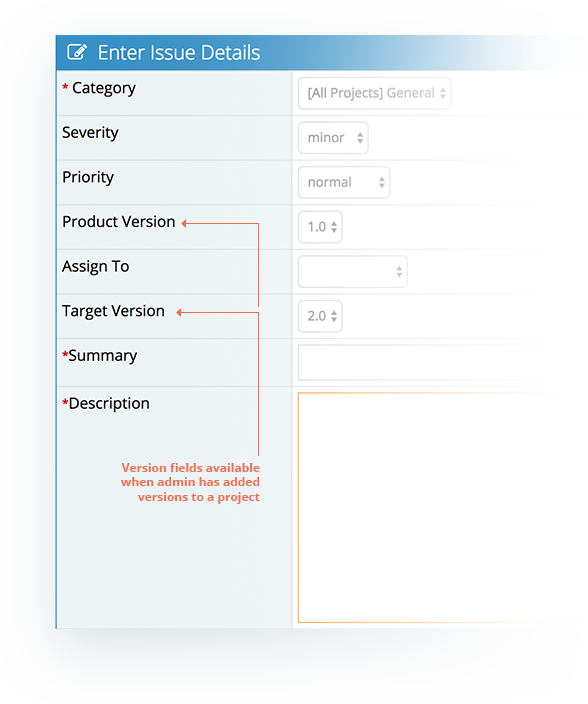

# Reporting an Issue

Once you have [created a project](/project_management/create_projects) and some categories, issues can be reported against these.

Head to the 'Report Issue' page.

If you have multiple projects, make sure the correct project is selected in the project filter in the top right of your screen. Then enter your mandatory fields:

1. **Category** - the appropriate area within the project in which to address the issue (See [Managing Categories](/project_management/manage_categories))
2. **Summary** – A brief title for the issues
3. **Description** – a detail description of the issue.

 

In addition to your mandatory fields, you can set **severity, priority, [tags](/issue_management/using_tags) and [view status](/issue_management/public_vs_private_issues)** as these apply to the issue. You can also **assign** it to a specific user directly from here as well as **[upload a file](/issue_management/attatching_files)** as an attachment. If you want to report more than one issue make sure to check the **report stay** box which will return you to the report issue screen after submitting.

 

There are options to set **version** information if you've created versions in your project. These are used to help organise your project issues and also to populate [Changelog](/project_management/project_changelog) and [Roadmap](/project_management/project_roadmap) information.

Then click 'Submit Issue'.

 

**Can I add, remove or reorder fields on this screen?**

You can utilize custom fields to add fields to this screen. Non-mandatory fields can be removed from this screen as a customization request. Native fields cannot be reordered and will always appear first but custom fields can be reordered by updating the sequence. (See [Adding Custom Fields](/customizations/custom_fields))

**Can I make more fields mandatory?**

We currently do not support making other native fields mandatory. However, you can make a custom field mandatory. 