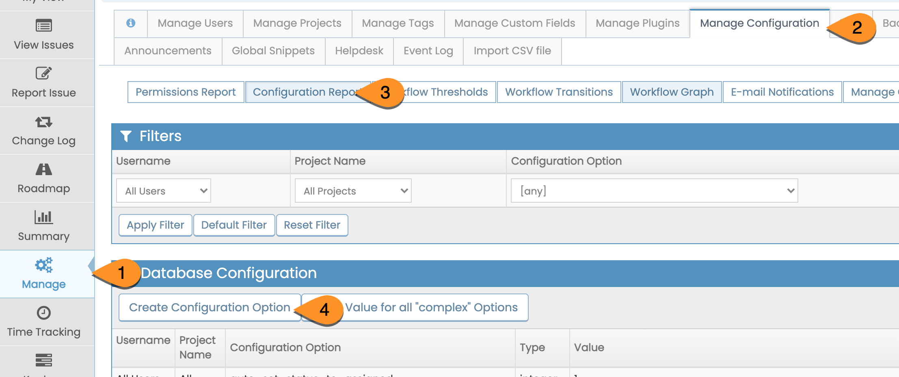

# Setting up Time Tracking

MantisHub enables users to setup time tracking so that team members can log time against issues they are working on.  This feature can be enabled by adding a number of configuration options. To add configuration options, head to the *'Manage' page, select 'Manage Configuration' and click 'Configuration Report' then select 'Create Configuration Option'*.

 

To enable the **time tracking** feature, add the following config option:

**Username**: *All Users*

**Project Name**: *All Projects*

**Config Option**: *time_tracking_enabled*

**Type**: *Default*

**Value**: *1*

To enable **time tracking with billing**, which allows you to set an hourly rate, add the following config option:

**Username**: *All Users*

**Project Name**: *All Projects*

**Config Option**: *time_tracking_with_billing*

**Type**: *Default*

**Value**: *1*

 

To enable **time tracking stop watch**, add the following config option:

**Username**: *All Users*

**Project Name**: *All Projects*

**Config Option**: *time_tracking_stopwatch*

**Type**: *Default*

**Value**: *1*

 

You can configure users access to Time Tracking with the below configuration options. Replace the below default settings DEVELOPER (55) or MANAGER (70) value with the desired [access level](/customizations/access_levels) as per this [access level](/customizations/access_levels) article:

- Access level to **view time tracking** details within the issue:

**Username**: *All Users*

**Project Name**: *All Projects*

**Config Option**: *time_tracking_view_threshold*

**Type**: *Default*

**Value**: *55*

- Access level to **edit or enter time tracking** details on issues:
Username: All Users

**Username**: *All Users*

**Project Name**: *All Projects*

**Config Option**: *time_tracking_edit_threshold*

**Type**: *Default*

**Value**: *55*

- Access level to **view reports** for time tracking:
**Username**: *All Users*

**Project Name**: *All Projects*

**Config Option**: *time_tracking_reporting_threshold*

**Type**: *Default*

**Value**: *70*

For more information on time tracking, have a look at our [Using Time Tracking article](/issue_management/time_tracking).