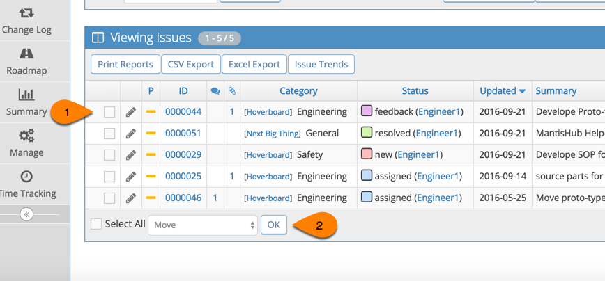
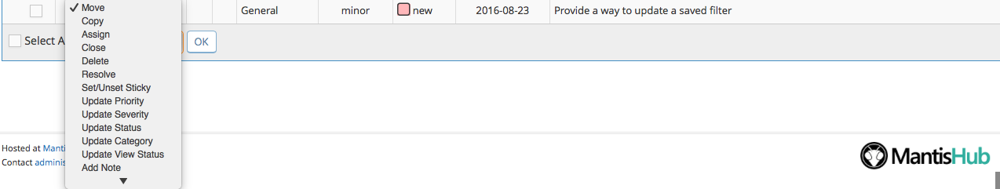

# Updating Multiple Issues at Once With Group Actions

If you want to perform an action for multiple issues at once, you can use a group actions via your "View Issues" page. 

1. Go to "View Issues" page and apply appropriate filters as needed. 

2. You can select issues individually to apply actions to (1), or you can choose to select all issues (2).`*` 

`*`*Note that 'Select all' only selects issues on the current page. If you have multiple pages you will have to repeat the action for subsequent pages*

 

3. Once you have chosen the issues you would like to apply an action to, click on the drop-down menu and select the desired group action. There are several actions you can choose from, such as move, copy, assign, close, delete, resolve, set/unset sticky, update priority, update severity, update status, update category, update view status or add a note. 

There are several actions you can choose from including: copy, assign, close, delete, resolve, set/unset sticky, update priority, update severity, update status, update category, update view status, add a note, attache tag or update version related fields. It will even create options here to update your custom fields. 

After selecting desired action do not forget to press the "OK" button.

 

