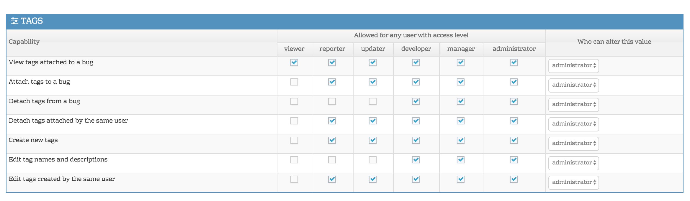

# Using Tags

There are several ways to organize issues including filing them under projects, categories, and tags. An issue can belong to one category and one project at any point in time.  However, an issue can have zero or more tags.  And tags can exist across multiple projects. This enables flexibility in classifying issues for more than one purpose.

Tags provide the following features:

- An issue can have zero or more tags.
- Tags are organic, can be defined and used on the fly by any user`*` and used on any issue.
- Tags can be used to filter issues.

Some good examples of tags include:

- Patch - this issue has a patch attached.
- Localization - the solution for this issue will require localization work.

You should think of tags as the equivalent of hashtags on Twitter.  It is just a lightweight way to classify and filter issues.

 

**Creating and Managing Tags**

Users that have access to create, remove and edit tags, can manage tags by heading to the *Manage menu* on the left and selecting the *Manage Tags* tab. Tags can also be created by simply entering text into the Tags field. A new tag will automatically be created with the entered text. 

**Tags permissions**

You can control access to your tags via [workflow thresholds](/customizations/wf_thres). By default, all users have access to tags as makes sense according to their access levels. e.g. viewers can see tags, reporters can create and attach tags etc. But if you wish to tailor access further, you can do so via the [workflow thresholds](/customizations/wf_thres). 

Head to Manage - Manage Configuration and click on Workflow Thresholds. Scroll down and you'll see the Tags section which allows you to control who can view, attach, detach, create and edit tags within your MantisHub. Like all our threshold configurations, these can be set for all projects or can be configured differently per project. 

