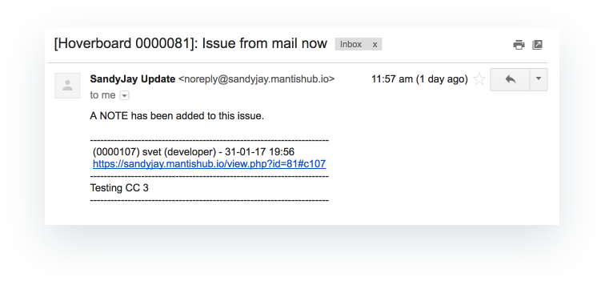
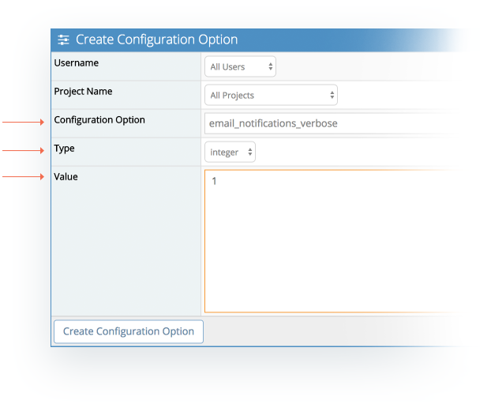
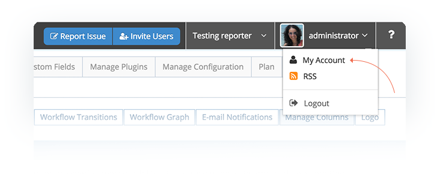
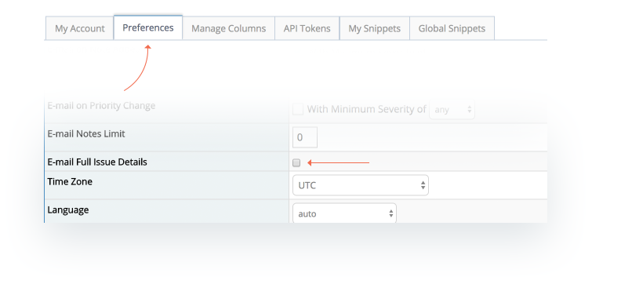

# Verbose and Non-Verbose Email Notifications

MantisHub supports two modes for your email notifications: Verbose and Non-Verbose.

By default your system is set to **non-verbose.** This means that rather than emailing out full issue details when a note is added, only details of the new note with reference to the specific comment ID will be emailed out. 

This setting can be overridden to enable verbose mode where the full issue detail is emailed including all previous notes when a note is added. The email update will reference the latest comment ID and so one email may be sent for several updates. 

Administrators can set verbose mode system wide by going to to *'Manage - Manage Configuration - Configuration Report'* and using the following configuration option:

***Configuration Option:*** *email_notifications_verbose*

***Type:***  *integer*

***Value:*** *1* 

 
Alternatively, individual users can set verbose mode for their account only via their account preferences. select 'My Account' from the drop down menu next to your username in the top right. Then select the preferences tab and ticking the 'Email full issue details' checkbox. You can also limit the number of notes shown in verbose notifications in the 'Email notes limit' field.

 
 

Status change email notifications are always verbose and will include all notes as well as the ticket history. Email notification triggers and recipients are determined by the settings in your [Email notification configuration.](/issue_management/config_email_notifs)