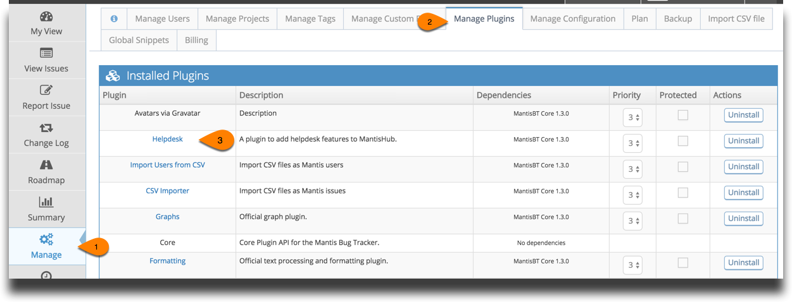
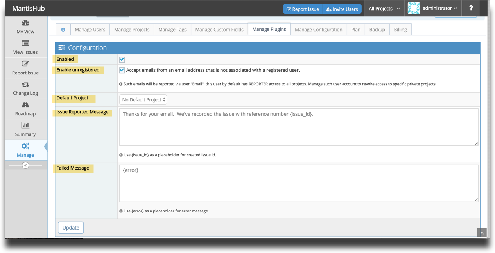
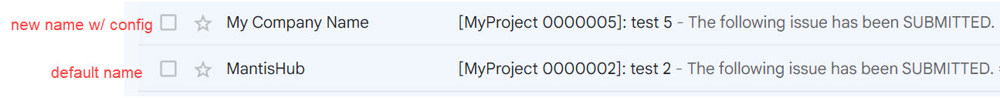
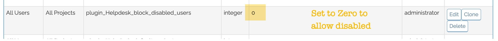

# Configuring The Helpdesk Plugin

[Video Tutorial](https://youtu.be/3pyDF5v2sCY)

<iframe width="560" height="315" src="https://www.youtube.com/embed/3pyDF5v2sCY?si=nJ7sKmYGjPUQQ-8L" title="YouTube video player" frameborder="0" allow="accelerometer; autoplay; clipboard-write; encrypted-media; gyroscope; picture-in-picture; web-share" referrerpolicy="strict-origin-when-cross-origin" allowfullscreen></iframe>

MantisHub's Helpdesk plugin is available to customers on [qualifying plans](https://www.mantishub.com/pricing) and provides the ability to have your users and customers email in support requests and have issues automatically created in your bug tracker. More details on how this all works in our article [Using MantisHub Helpdesk to Report Issues](/mantishub_helpdesk/report_email).

**Plugin Configuration**

The Helpdesk plugin is installed by default so to enable this feature, simply go to 'Manage' - 'Mange Plugins'. You'll see it listed in the Installed Plugins. 

To configure MantisHub Helpdesk click on 'Helpdesk'. 

**Enabled** - check this box to activate the helpdesk plugin and allow your MantisHub users to submit issues via email. 

**Enabled Unregistered**- check this box to allow customers who are not registered as users in your MantisHub to submit issues via email. 

Enabling this will create an account with the username 'Email'. The user is set up with a global access level of reporter for all public projects. It is also automatically added as reporter to all your existing private projects. If you wish to block submission of issues via email for any private projects you will need to make sure to [remove the user](/user_management/create_user_accounts) from these projects. For projects that are made private after enabling the Helpdesk plugin, the Email user will need to be explicitly added. 

This user is listed as the reporter for all issues submitted via email with an unregistered email address. The customers real email address will be listed in the 'Helpdesk' section in the issue details.

**Default Project** - select a project from the dropdown to be the destination for issues created via email to `yourmantishubname@mantishub.io.` Note that unless this is set, emails to this address will NOT work. For email issue submission to other projects, check out our article on [Using Email Reporting](/mantishub_helpdesk/report_email). All emailed issues will be placed in the global '[All Projects] General' category*.

**Issue reported message** - this is the content for automated email response when issues are created. Note you have a placeholder {issue_id} for the issue number you can include in this message.

**Failed Message** - set the content for automated response when issues fail to be created. Note you have a placeholder {error} for the failure reason that you can include in this message.

Then click 'Update'.

**Exclusion For Forwarding Address**

It's common to use a personalised incoming email address for your support requests and have this forward to the MantisHub Helpdesk email address i.e. have `support@yourdomain.com` forward to `yourmantishuburl@mantihub.com`. With the introduction of support for cc'd emails you will also need to add a configuration option to prevent your forwarding email address from being included in emailed tickets as a cc'd recipient. If you do not add the exclusion configuration option then email updates will be forwarded to your Helpdesk email address and created a new duplicate ticket in the system. 

To configure the configuration option head to 'Manage' - 'Manage Configuration' - 'Configuration Report' and create the following configuration option

*All Users, All Projects,*

*Config Option:*           **plugin_Helpdesk_exclude_emails**

*Type:*          **String**

*Value:* ***< your fwding email address >***

If you have multiple emails that you would like to exclude, please use the
following:

*Type:* **complex**

*Value:* **array('< your-email-goes-here >', '< another-email-goes-here >')**

then click CREATE CONFIGURATION OPTION

**Change of 'From' Name**

The last thing you may wish to configure is the 'From Name' of you Helpdesk emails. By default system emails for these issues will come from MantisHub `noreply@<yourManitsHubname>.mantishub.io`.

You can change the from name from MantisHub by setting the following configuration option via 'Manage' - 'Manage Configuration' - 'Configuration Report'

*All Users, All Projects,*

*Config Option*: ***from_name***

*Type*: ***string***

*Value*: ***< your desired name >***

Example, config added with the value 'My Company Name':

Note that the above from name is used for all notifications, not just Helpdesk related ones.

**Blocking of Disabled Users**

By default, any users previously **registered** in the system, that have been disabled, are blocked from submitting Helpdesk issues. Since you have disabled them, we don't allow them to circumvent this by submitting issues as an unregistered user. However, if you would like to un-block them for any reason, you can configure the configuration option 'plugin_Helpdesk_block_disabled_users' and set it to off (i.e. value = 0).

To create a configuration option, head to Manage -> Manage Configuration ->Configuration Report. Select 'Create Configuration Option' and enter the above configuration with value 0 to allow disabled users.

You can go back and edit it at anytime to block disabled users by entering the value as 1 or simply deleting the configuration option as the default setting is to block disabled.

`*`If the General category is accidentally deleted, your email reported issues will be rejected, you will need to follow the process as per [change default category](/project_management/change_default_catgs) to correct this.

