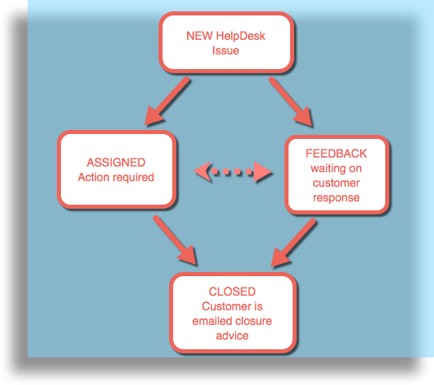
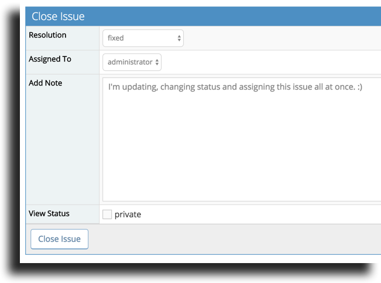
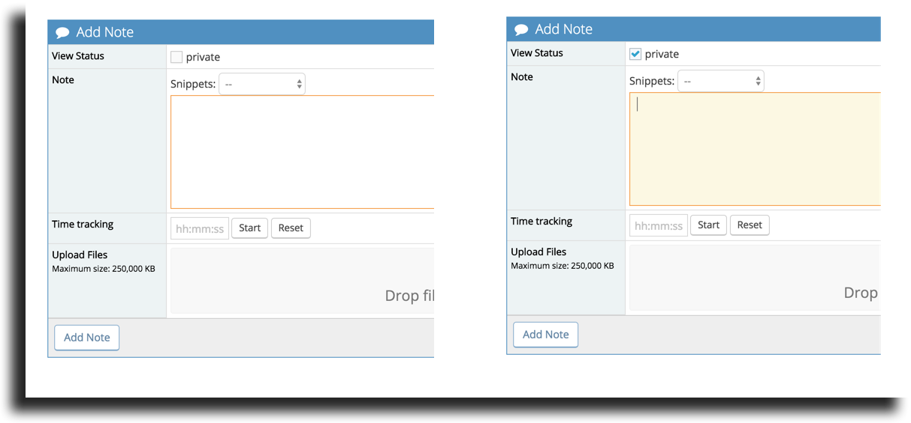
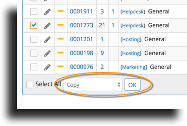

# Handling Incoming Helpdesk Issues

 When dealing with incoming Helpdesk issue we have some advice for you. In addition to setting up helpful integrations and filters as discussed in our [guidelines article](/mantishub_helpdesk/setup_projects) we have some simple tips to effectively managing your customer support in MantisHub.

 1. Make sure to properly **define your workflow**. Our suggestion for your Helpdesk issue lifecycle is to progress your issues from 'new', 'assigned', 'feedback' and 'closed'. Issues will start off as 'new' in your system. If you triage your HelpDesk issues, they can then be assigned directly to a team member and enter an assigned status whilst waiting for the team member to respond or action this issue. You can move from a 'new' or 'assigned' status to 'feedback' and enter a response to the customer. By default the issue will also be assigned to you. When the customer responds, the ticket will automatically be changed back from 'feedback' to 'assigned' status. Once the customer issue is addressed and customer confirms the fix, you can move the issue into a 'closed' status. The customer will be advised of the issue closure.

 

 2. The **best way to update your issue** and navigate between issue statuses is by by clicking the 'Change Status to' button and selecting the appropriate status in the drop down. You can then enter any comments to the issue via this form as well as change assignment, set view status, enter resolution information or any other custom information from this form. If you need to update the issue without changing the status, then you can go ahead and use the 'Add Note' option in your 'View Issue Details' form or if you wish to re-assign without commenting, you can use the 'Assign to' button.

 

 3. Make sure to **differentiate your public and private notes**. Public notes which will be sent out to your clients and your private notes that are shared with your team. These are set using the tick box in your notes field. By default all notes are set to public

 

 4. **Link** your Helpdesk tickets to your internal work items. The great thing about having your customer ticketing system integrated with your internal issue tracking is that you can refer directly to the customer ticket for details.  Check out our article on [Issue relationships](/issue_management/linking_issues) for details. 

You can link to existing work items or use the copy issue feature (view issues - group action) to create an internal work item in another project based on a customer reporter issue. 

It is important to remember that the customer will get notifications only for the following actions:

- When a public note is added.
- When a helpdesk issue is moved from an open status(new, feedback, assigned etc) to a resolved status (resolved or closed).
- When a helpdesk issue is moved from a resolved status (resolved or closed) to an open status.

Other changes are not communicated to customers, so issues can be assigned, private notes added, relationships added, tags added, etc without customers getting any notifications.  Also note that customer notifications only contain the relevant action, the person who has performed the action, ticket # and title, and the associated note.  The rest of the issue details are not included in such notifications.