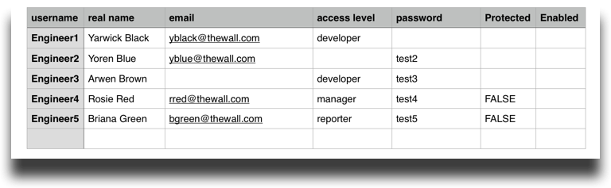
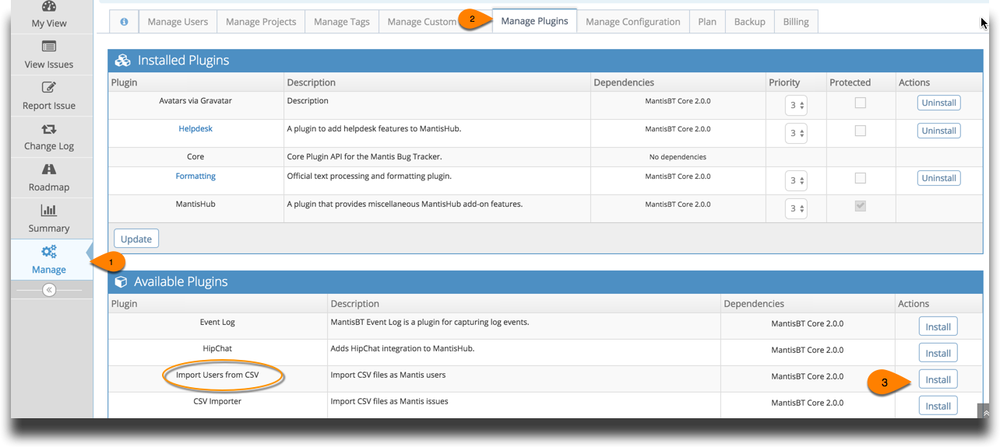
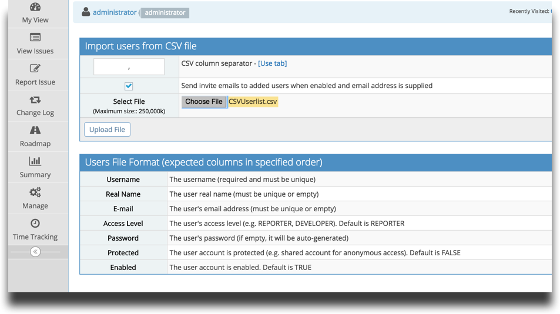
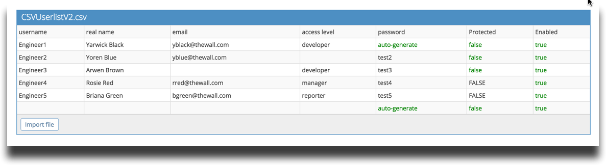
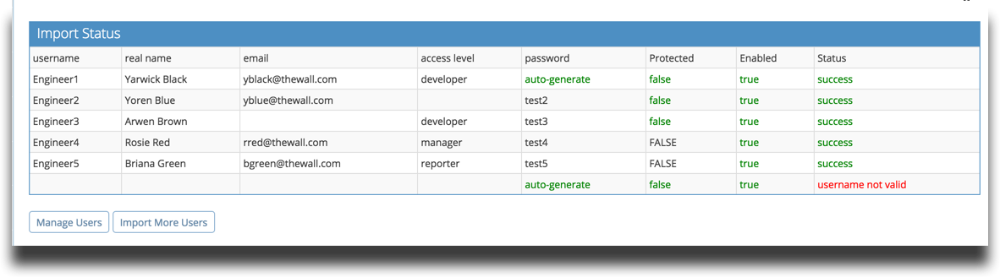

# Importing Users from CSV

When migrating to MantisHub from a different system, you may want to export users to a CSV file from your previous system, update them in Excel, and then import them into MantisHub.  This can be achieved using the Import Users plugin.

Firstly, create a CSV file with the following columns as specified in the plugins 'User File Format':

- Username
- Real name
- Email address
- Access Level
- Password 
- Protected
- Enabled

Be sure to include the column names in your file as this is expected. Empty fields will assume the default values (Default for: Access level - REPORTER, Protected - FALSE, and Enabled - TRUE). Empty password fields will auto-generate a password for the user.

To install the plugin, head to Manage - Manage Plugins and click on the 'Install' button for the 'Import Users from CSV' plugin. You'll see it listed in Available Plugins. Once installed it will be listed in the Installed Plugins.

To import users go to Manage - Manage Plugins and click on 'Import Users from CSV' .

Then:

1. Note the separation character (comma by default, click [Use tab] to switch to tab)
2. Check the 'Send invite emails' box if you wish to send email invitations to your users on account creation.
3. Choose the file for upload and click 'Upload File'. 
4. It will display a preview of your file. Black text shows the contents of your file and green text shows where the system will populate these entries (e.g. with defaults). If all looks good, click 'Import file'.

You'll see an import status screen showing you what was actioned. Any errors will come up in this screen in red text. If the system finds an existing username or real name it will return an error here and skip the addition of this row entry. All other rows will continue to be created. 

You may want to address any errors by creating a new file with the failed rows, addressing the errors that were reported and re-importing.