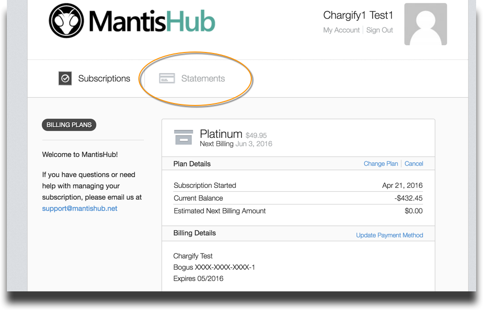
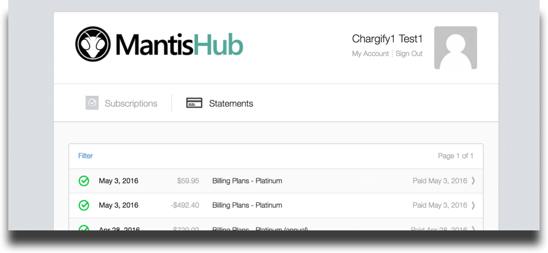
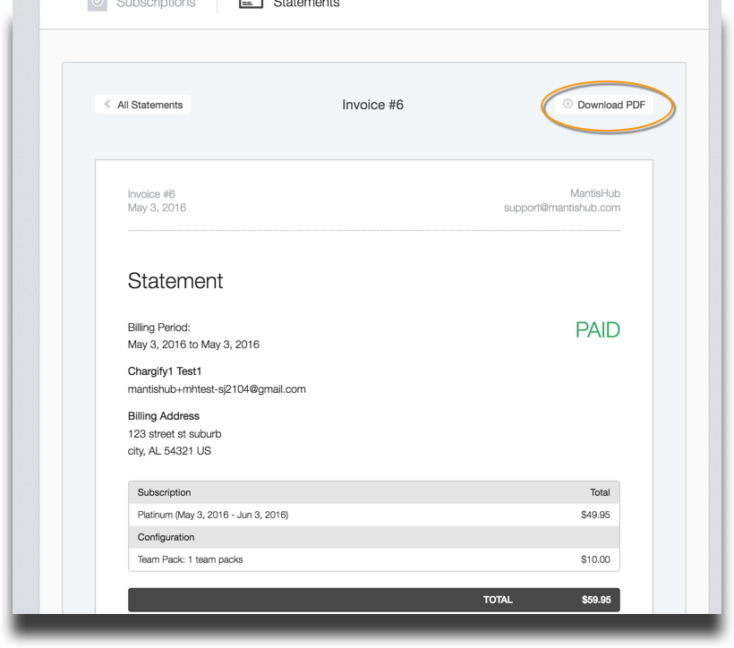

# Downloading Invoices and Statements

MantisHub's billing system automatically emails the registered account owner whenever there has been a charge against their payment method. To access specific details, you can view and download your invoices via your account management interface.

All users in your system with administrator access level in MantisHub will be able to [access the 'Billing' tab within your 'Manage' page](/user_management/login_billing). From there, click on the 'Statements' option at the top of the page.

Choose the relevant statement from the list to view it.

You also have the option to download it as a PDF.

