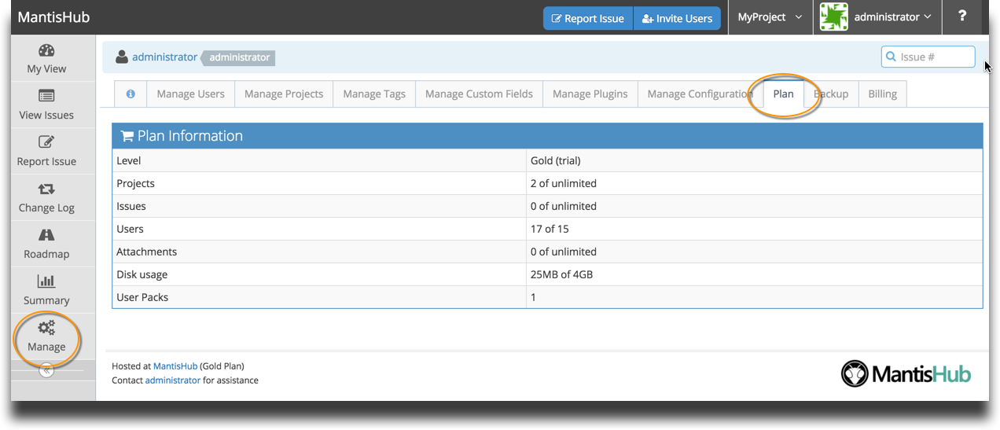

# Plan Information

You can access your plan information from the 'Manage' Page. Select the 'Plan' tab and you'll see displayed your Plan level as well as total projects, issues, users and disk space as compared with your plan thresholds.

As you add new user or increase the size of your database, MantisHub will automatically calculate when you need extra user packs or disk space and add them to your account to prevent interruptions to your productivity.  You can easily keep track of them here.

You can find details of our various plan options on our [website pricing page](http://www.mantishub.com/pricing). [Changes to your plan](/plans_billing/switching) can be made by administrators via your 'Billing' tab. You’ll also find your payment and [invoice information](/plans_billing/download) there.

