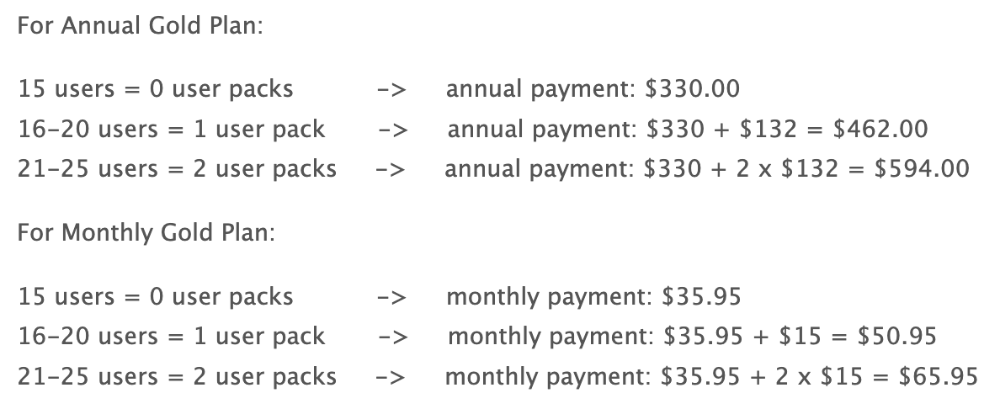

# Storage and User Pack Charges

Each of our plans come with a set of included user accounts and a data storage allowance. Plan allowances are:

- Gold - 15 users & 5GB.
- Platinum - 30 users & 10GB storage.
- Platinum Bulk plan options for 100+ users (contact support for details or check out the [website pricing calculator](https://www.mantishub.com/pricing)).

As your team grows and you add more MantisHub users or increase your data, we will automatically add 'User Packs' which cover 5 user accounts or 'Storage Packs' for 1GB extra data as needed. Packs are priced monthly, but you can receive a significant discount if you are [paying annually](/plans_billing/monthly_annual).

We check your account once a month for user account or storage increases and decreases. If we find an increase that requires an added pack, we'll pro-rate the cost of the pack up until your next renewal date. If we find a decrease, then will we add a pro-rated credit to your account.  Monthly plans will have the charge accrued until next renewal whereas annual plans will be charged as user packs are added. 

User packs cost $15pm for monthly plans and $132pa for annual plans. 

Storage packs cost $3.60pm per GB for monthly plans and $32pa per GB for annual plans.  

Let's take an example of a Gold plan and the corresponding pricing based on the number of user accounts:

You can track your usage on your [Plan Information](/plans_billing/plan) page. If your requirements change, you can [switch plans](/plans_billing/switching) at anytime.