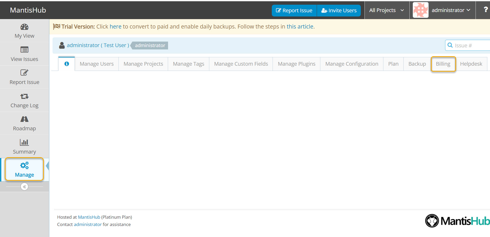
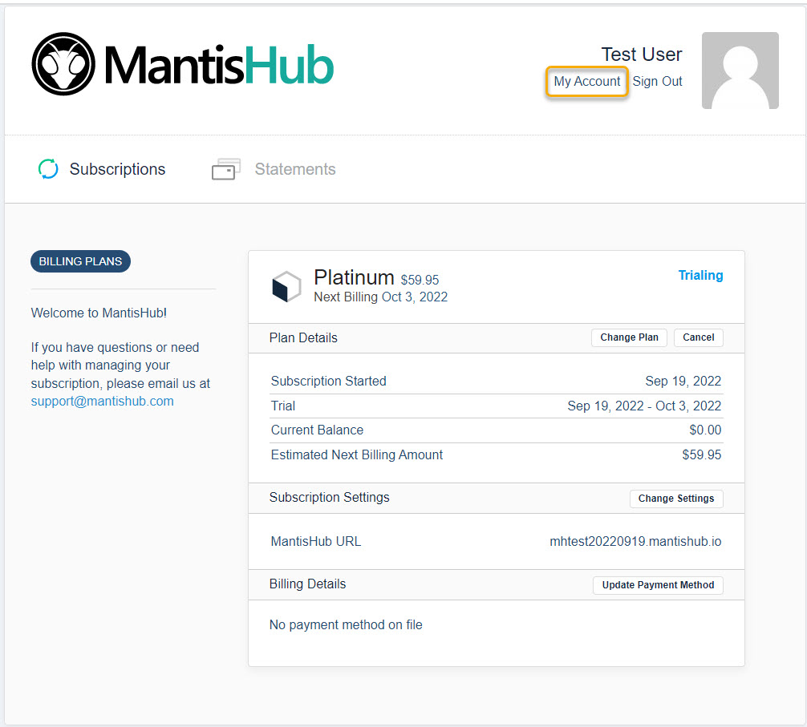
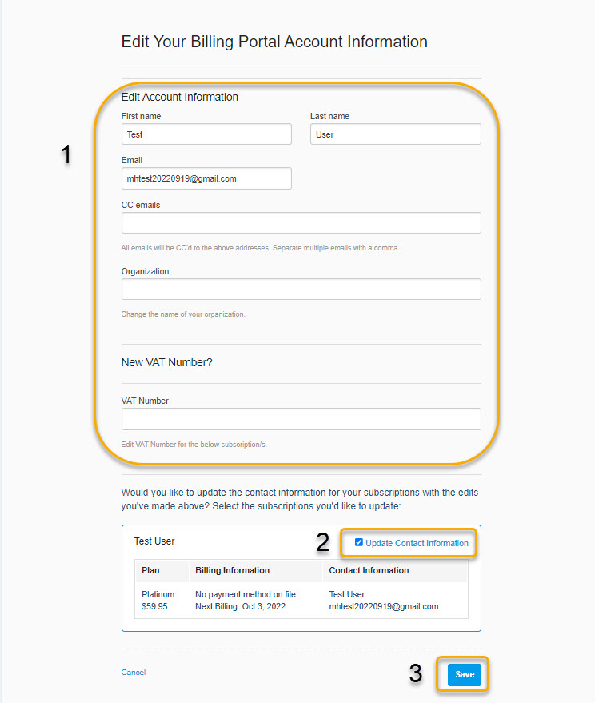
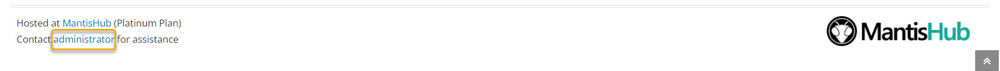

# Updating Customer Contact Details

The name and email address used to create your MantisHub account is considered the account owner and this email address is used for all correspondence from MantisHub. This includes emails for invoices/statements and system notifications. 

To update your contact details, you will need to have administrator access level. Login into your MantisHub service.

1. Go to the 'Manage' page and select the 'Billing' tab. A new window will open up with your account management interface.

2. Select 'My Account' from the top right corner under the account name.

3. Update the contact details, **select the 'update contact information'** checkbox, and then hit 'Save'. You can update the account owner name and email address, include additional email addresses to receive billing notifications, add/update your organization name, as well as add/update your VAT.

*Note*: If you do not select the '**update contact information**' checkbox before saving, the billing system will not sync your changes. You will see it on your end but it will not be updated in the billing system. 

If you update your account owner email address it won't reflect in the footer of your MantisHub.  Please contact support via email to update this. 

