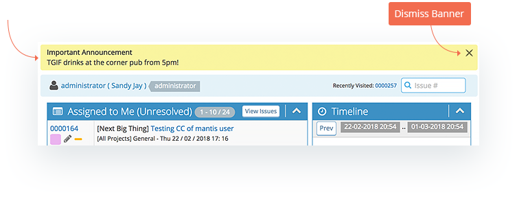
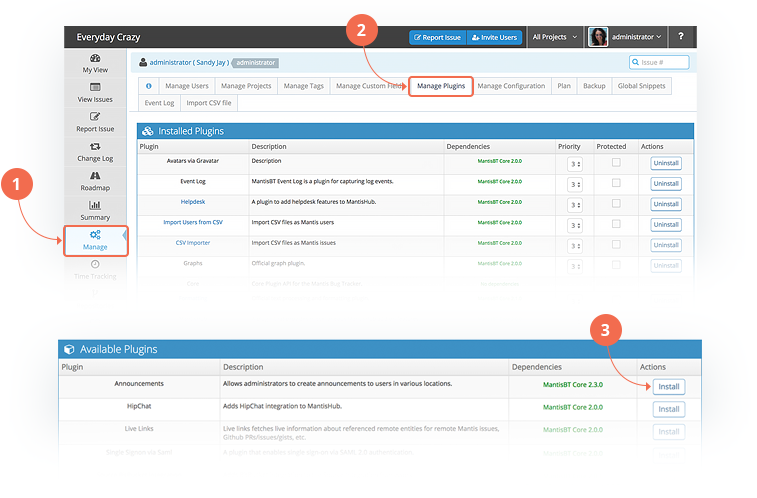
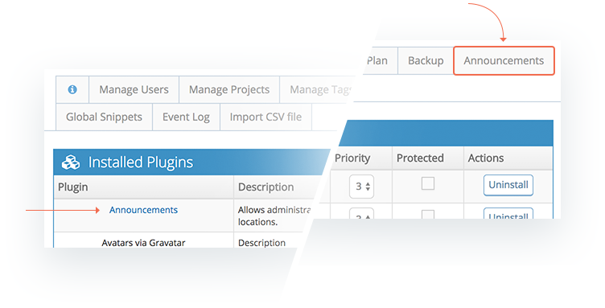
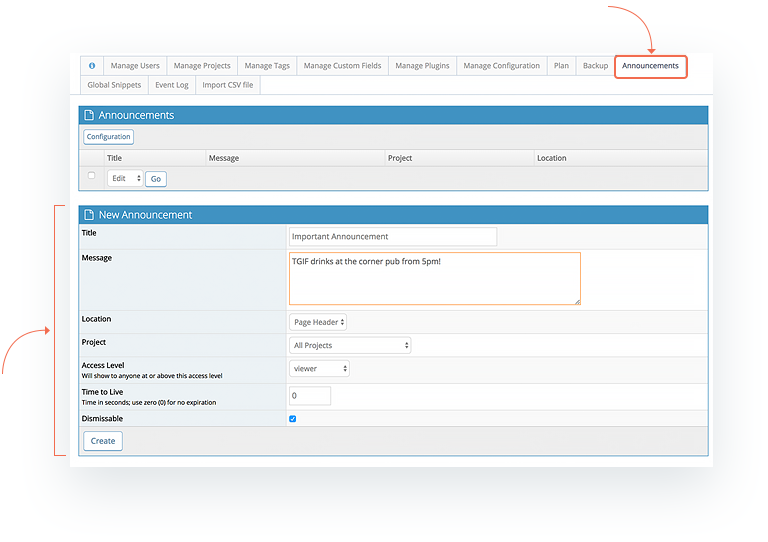

# Announcements Plugin

The announcement plugin allows privileged users to configure a banner to appear to either all users or a subset of users depending on their access levels. Banners can also be set either across the whole system or for specific projects. Users can dismiss these notifications once read or actioned or administrators can elect to disable the dismiss option (cross in the top right corner of the banner). 

To install the plugin and allow creation of announcements, **administrators** can go to *'Manage' - 'Manage Plugins'*. Under '*Available Plugin*s' just click on the Install button next to the Announcements plugin. 

Once installed, you'll see a new tab available in the Manage section of your MantisHub. By default, MANAGER level users and above are allowed to create and manage announcements. 

**Administrators** can change the minimum access level allowed to create and manage announcement within the plugin configuration. Either by clicking the configuration button within the '*Anouncement*' tab OR through the '*Manage Plugins*' page by clicking the hyperlink for the Announcements plugin. Select the minimum user level from the dropdown and click update. Note that access level set for Announcement configuration is across all projects and cannot be different for different projects. 

To setup a new announcement, go to the *Announcements* tab on your Manage page. You will see a New Announcement section where you can set up a new banner announcement. Fill in the announcement configuration and click 'Create'. Configuration options are shown below.

**Title** and **Message** will be the content that appear in the announcement banner to users. The announcement message be multi-line and will also convert any [Markdown](/issue_management/markdown_support) shorthand used. 

**Location** at the moment is only Page header and will appear at the top of the MantisHub page across all views, but other options may be added in the future.

**Project** can be set to all projects or a single project. If you wish to have an announcement for a subset of projects, you will need to create a separate announcement for each project..

**Access Level** sets the minimum [access level](/customizations/access_levels) to which announcements will be visible. If you are setting an All projects announcement then it will display depending on the users [global access level](/user_management/auth_access_levels). For specific project announcements, it will display according to the users more specific project level access if set. 

**Time to Live** defines how long the announcement will appear. This is displayed in seconds. A setting of 0 means no expiration and will leave the announcement on until manually removed or dismissed by user (if dismissable setting is checked).

**Dismissable** if checked, allows users to dismiss the banner.

It is recommended to create new announcements rather than re-use an expired announcement. That way, if any users that have already dismissed the old announcement they will still receive the new one. If this is desirable and you do NOT wish users who have already dismissed the banner to receive the announcement again then you can re-use it by setting a new expiration.

If you have more than one announcement active at a time, the system will alternate between announcements as users click through different views.