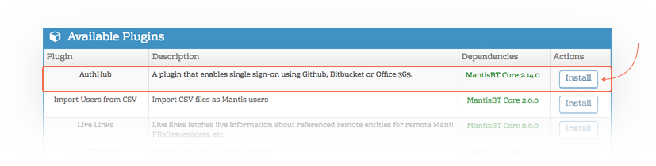
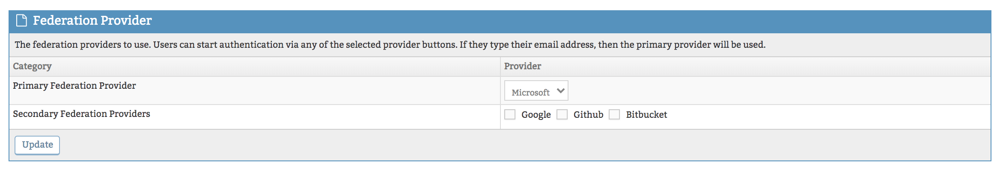
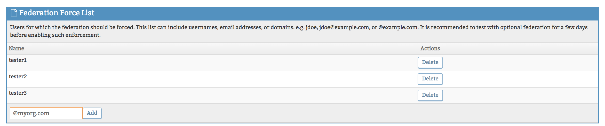
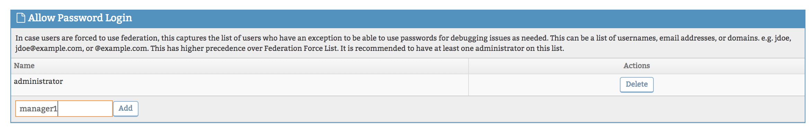
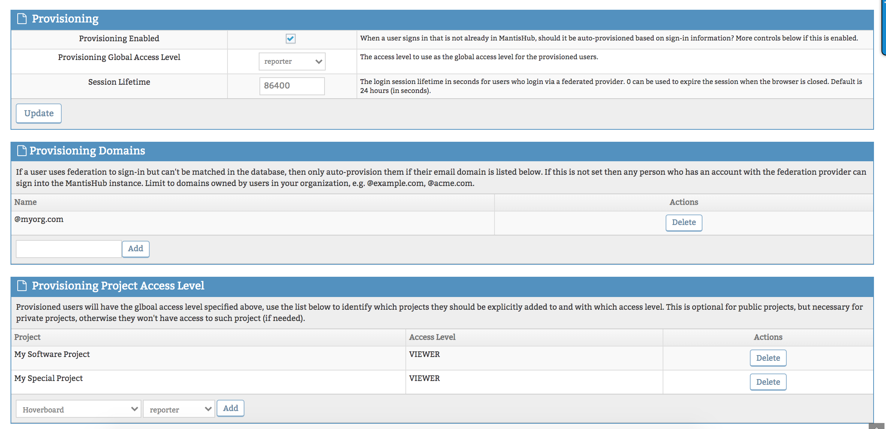

# Configuring AuthHub for Single Sign-on (SSO) Plugin

MantisHubs AuthHub plugin is available for qualifying plans and enables Single Sign-on by integrating with your identity provider of choice to authenticate and provision your MantisHub users. 

A list of supported providers and the qualifying plans are listed below:

- [Azure AD (Office 365)](/plug_ins/azuread) - *for Platinum volume plans (200, 300, 500, 1000 users)*
- [Google / Google Suite](/plug_ins/google_auth) - *for Platinum volume plans (200, 300, 500, 1000 users)*
- [Github](/plug_ins/github) - *for Gold plans and above*
- [Bitbucket](/plug_ins/bitbucket) - *for Gold plans and above*

**Enabling SSO**

Set up is simple, if you are on the correct plan, you will see the AuthHub plugin listed in the Available plugins section. You can activate the service by [installing the AuthHub plugin](/customizations/plugins)

Once the AuthHub plugin is installed, you can click on the hyperlinked AuthHub to enter the configuration. 

**Configuration**

**Define your provider(s)**: Select your primary **federation provider** from the drop-down list. You also have the option to select a secondary federation provider to allow a second login option for your users. AuthHub will attempt authorization to your secondary provider if authentication to your primary provider fails AND auto-provisioning is not enabled for the user. 

**Force SSO login:** By default, your users will still have the option to create and use their MantisHub credentials as well as using your federation provider. If you wish to force users to be authenticated through your SSO ***primary*** provider then you will need to define a force list. You can define this using domains (@example.com), email addresses (jsmith@example.com) or usernames (jsmith) or a mix of all. We highly recommend you thoroughly test user access over a few days to ensure everything runs smoothly before implementing a force list.

**Permit users to use both credentials:** Once you have created a force-list you may need to define certain users that will retain permission to log in using MantisHub native credentials. Note that this list has higher precedence over the force list. It is *always* recommended that you have at least one administrator account on this list to retain access to the system as they may need to disable or troubleshoot sign-on federation issues. You can specify this list using usernames, email addresses or domains. e.g. jsmith, jsmith@example.com or @example.com

**Auto Provisioning**

**Enabling Auto Provisioning:** For users not already created in MantisHub, you can turn on auto-provisioning so that a MantisHub user account will be automatically created for users who successfully authenticate to your **primary** federation provider. This is OFF BY DEFAULT but to turn it ON as well as set default access levels you need to configure it as follows:

Firstly, in the first Provisioning configuration section. check the box 'Provisioning Enabled' to turn it on. The default global access level for the newly provisioned user is reporter but you can also change this here. This is also where you would change the session lifetime if needed. The default is 24hrs. Note that this setting will apply to all SSO authenticated users, not just those who are auto-provisioned. Click '*Update*' to apply the configuration. 

**Defining your auto-provisioning scope:** Next, you will need to define the provisioning domains that are allowed to be auto-provisioned for MantisHub. Note that if this is left blank then **any users who have an account with the federated provider can sign up to your MantisHub instance** so be sure to limit this to domains owned by your organization.

 

**Set project-level access:** Lastly, you can set defaults at a project level for your provisioned users access. This is necessary for all ***private*** projects you wish new users to have access to and for cases where project access level is not equal to the default global access level specified above. If for example, you want any new users to have reporter access to the majority of your projects but there are one or two special projects where you want them to only have viewer access, you can add this in the 'Provisioning Project Access Level' section. If you don't specify any private projects in this section then newly provisioned users will not have access to these projects.

