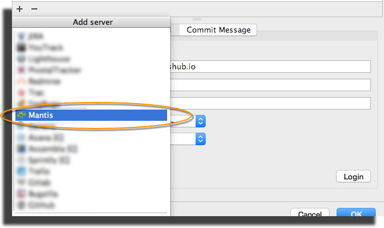

# JetBrains IDEs Integration

This integration with MantisHub could be used for tracking work items and improving workflow by attaching MantisHub tasks with [JetBrain IDE (e.g. PhpStorm, IntelliJ, WebStorm, etc) contexts](https://www.jetbrains.com/help/phpstorm/2016.2/managing-tasks-and-context.html).

It takes 2 simple steps to set up

1. Click on "Configure Servers" and add a Mantis Server

2. [Create an API token](/api/connecting_mh_api_tokens) in MantisHub and then plugin your Mantis URL, username and API token as the password.

***`*`Note***: *If the project and Filter section is displaying "Login first" this means you haven't logged in. Do so via the Login button in the bottom right. In some screen resolutions the Login button might not be visible and you would need to expand the window so that it appears.*

After connection is established all tasks will be shown in a drop down menu as shown below.

Each task could be associated with a JetBrains context including a change list, workspace, etc. Associating task with a context will re-open all files that were open before switching tasks. It is not uncommon that developers work on multiple tasks at a time, so picking up where left off is very convenient, distraction free, saves time and hassle.

Each task could also be associated with a branch, so every time the task is changed, the branch automatically changes along with the context. 

