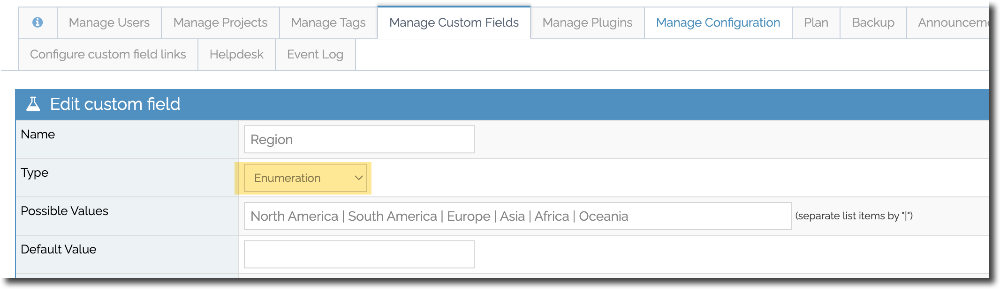
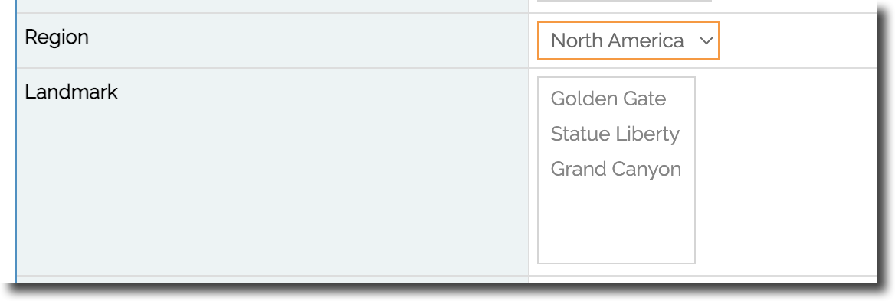
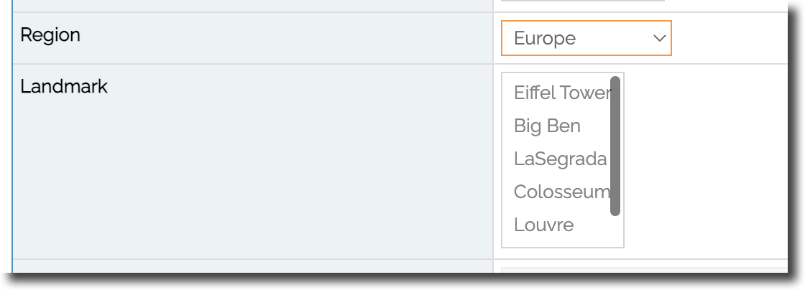
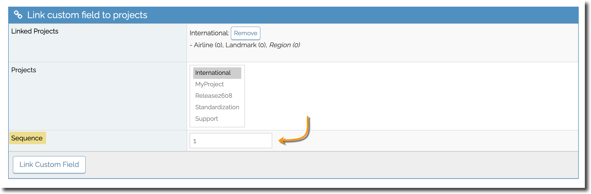
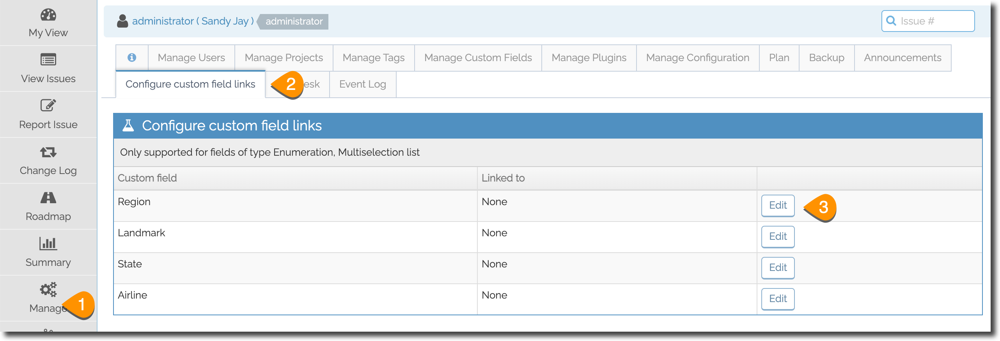
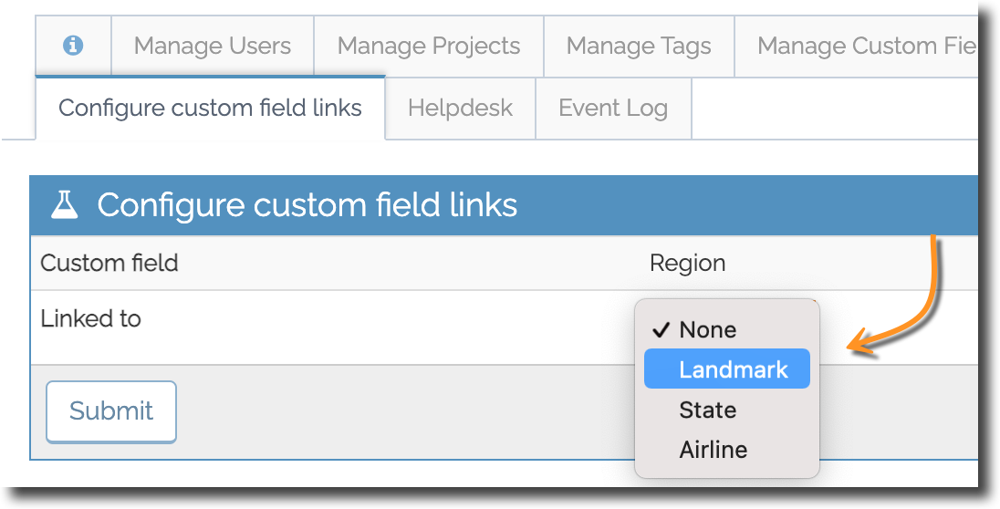
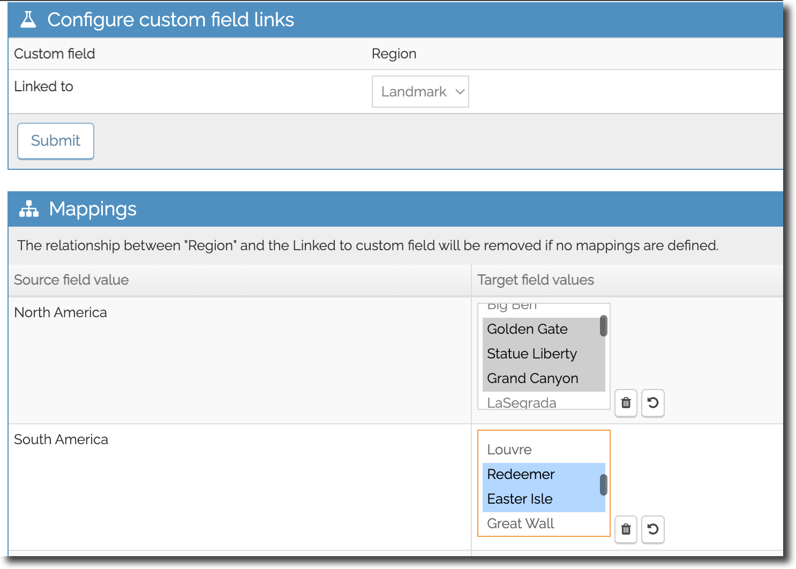

# Linked Custom Fields Plugin
The Linked Custom Field plugin allows you to set up a relationship between two custom fields where the selected value in the first determines the value options presented in the second field. 

 

For example, you can have a custom field called COUNTRY and a second field called STATE and depending on the country selected, the values presented in STATE will vary. 

 

To utilize linked custom fields, the fields need to be of type ENUMERATION or MULTI-SELECT, where your options for the value of the custom field are defined.

**Configuring Linked Custom Fields**

In our example we have custom field 1 - 'Region', that we want to link to custom field 2 - Landmark. Such that when users select a value in Region, only a subset of the values in Landmark are presented to the user. 

To configure linked custom fields:

**Step 1:** Create your two custom fields of type enumeration or multi-select with all the values required, and link them to the relevant projects. See our article on [Adding Custom Fields](/customizations/custom_fields) for details. 

When setting up your customer fields, it is recommended that you have Custom field 1 appear first in your issue details since the values of this field will determine the values in the 2nd field. To do this, set the sequence number when linking your field to the project. 

**Step 2:** Link the two fields:-

Head to the *Manage* page and select the "Configure Custom Field Links" tab. Next to custom field 1 (in our example, this is 'Region') click *Edit*. 

then select the second custom field (in our example this is Landmark) in the "Linked to" dropdown list. 

A Mappings section will appear in the screen below where you can map the field values in custom field. Against each value option in field 1 (e.g. Region) select the value options from field 2 (e.g. Landmark) that you would like to appear when this value is selected. 

To select more than one value, hold down the Shift or Ctrl/Cmd keys. Selecting no values means that all the values will be available. 

