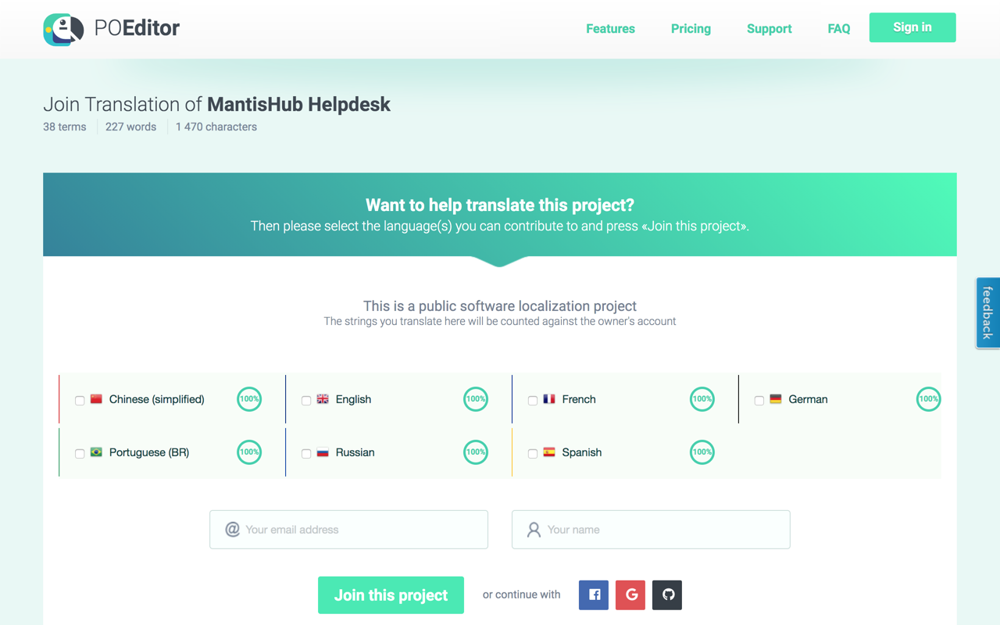

# Localization of MantisHub Plugins

Users can change their language preference within MantisHub via their local account preferences. Administrators can also change the default system language. Details on this can be found in our [Changing Language](/user_customizations/change_language) article.

MantisHub plugins leverage a tool called POEditor to enable customers to provide localization for these plugins in languages customers use. They can also localize strings in existing languages that were newly introduced and not yet localized. Such contributions will not immediately reflect in your MantisHub, but will show in future releases.

So, go ahead now and signup for POEditor to get started with contributing to MantisHub localization for your users and others:

**POEditor Links**

The links below will reflect for each plugin the languages available and the percentage of strings that are localized. The goal would be to have more languages with 100% of strings localized. If you wish to contribute, then you would use these links to sign up to join the project.

- AuthHub - https://poeditor.com/join/project/JBmuheK1DM 
- EventLog - https://poeditor.com/join/project/G1HEoPEik8 
- Helpdesk - https://poeditor.com/join/project/fzaLzR6ssA 
- Import Users - https://poeditor.com/join/project/PR9MCqwwtc 
- Kanban - https://poeditor.com/join/project?hash=1Ns1FkSSqS
- Live Links - https://poeditor.com/join/project/YdW5Wn50W7 
- MantisHub - https://poeditor.com/join/project/JsbWt9EJBi 
- Slack - https://poeditor.com/join/project/rIDOp1rGTd 
- Teams - https://poeditor.com/join/project?hash=WM7d0hDsTl 
- Trim Attachments -  https://poeditor.com/join/project/4AKp7ushds 

**Signing up to POEditor**

POEditor is an online service that allows users to sign up to collaborate on localization. You will need to:

1. Head to this POEditor link for the desired plugin (see above).
2. Check the box for your language of choice.
3. Provide an email address & name and click "Join Project" (or use alternate login option via Google, Facebook or GitHub)
4. You will be sent an email with your account details including a generated 

**Which language do users get?**

Each signed-in MantisHub user will get the default system language or the language they configured. However, for your own customers that use Helpdesk plugin, they will see the language that is associated with the user 'Email' which is the reporter for helpdesk emails.

To change the language for 'Email' user:

1. Sign-in as admin and go to 'Manage' -> 'Manage Users'.

2. Click on the 'Email' user, uncheck the 'protected' flag and save,

3. Go to the 'Email' user account preferences and set the desired language, and click Update Preferences.

4. Lastly check the 'protected' flag again for 'Email' user and save.

 

If a language has some strings that are not yet localized, such strings will show up in English language.