# Chat Integration for Microsoft Teams

Part of the Microsoft Office suite, MS Teams is a chat application that provides a platform for team communication. Integrating MS Teams with MantisHub allows mapping MantisHub projects to MS Teams channels. This means you can receive notifications into MS Teams when issues are actioned. 

**Setting up MantisHub and Microsoft Teams Integration**

**1. Create Incoming Webhooks**

Firstly you should create the desired channels in MS Teams for the integration. You can name this for Projects in MantisHub that will have a mapping to a channel. Then you will need to add an incoming webhook to this channel in MS Teams. 

Click the ellipses (...) next to your channel and select *'Connectors'*. Then click the *'Configure'* button next to *'Incoming Webhooks'*. For more information on adding Connectors or specifically [webhooks](https://docs.microsoft.com/en-us/microsoftteams/office-365-custom-connectors#develop-custom-connectors) head to the [MS Teams documentation](https://docs.microsoft.com/en-us/microsoftteams/office-365-custom-connectors).

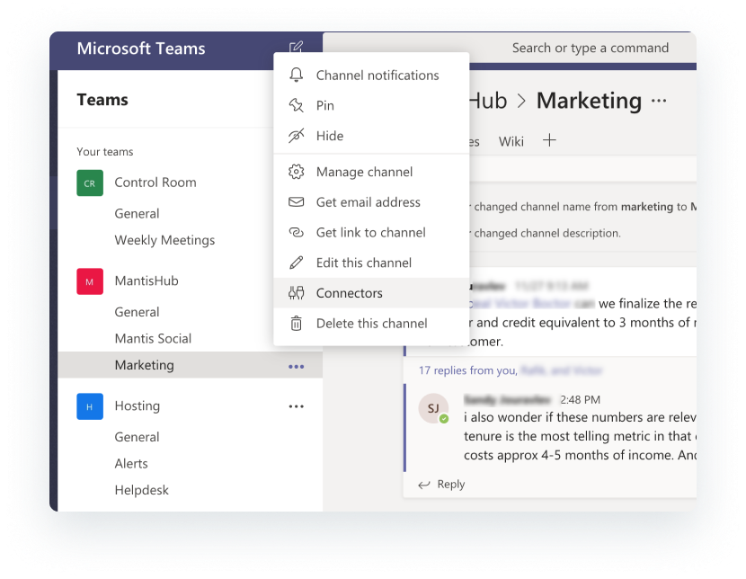

Give the webhook an appropriate name. This name will be displayed in Teams messages. You also have the option to upload an icon to be displayed next to MantisHub messages, attached to this article (way down the bottom there) is a jpg of the MantisHub logo that you can save and upload if you wish. Click '*Create*'. You will see a Webhook URL generated. Copy the URL and then head into your MantisHub. 

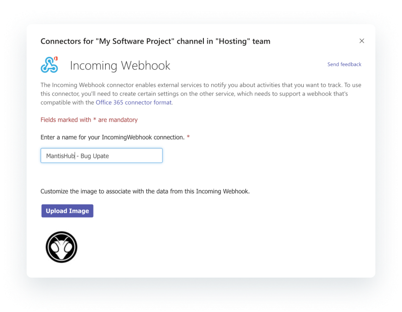

**2. MantisHub Plugin Configuration**

Go to *Manage - Manage Plugins*. If you haven't already installed it, you should see the Teams plugin in the Available Plugins section. Click install then click the *Teams* hyperlink to go into the plugin configuration. 

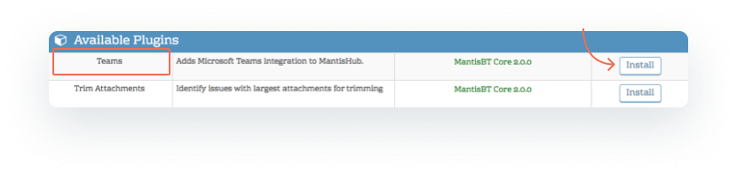

Within the plugin configuration, you can select here the included fields, including custom fields,  and type of updates you would like in your Teams notifications. See the **Notifications** section further down in this article for details.

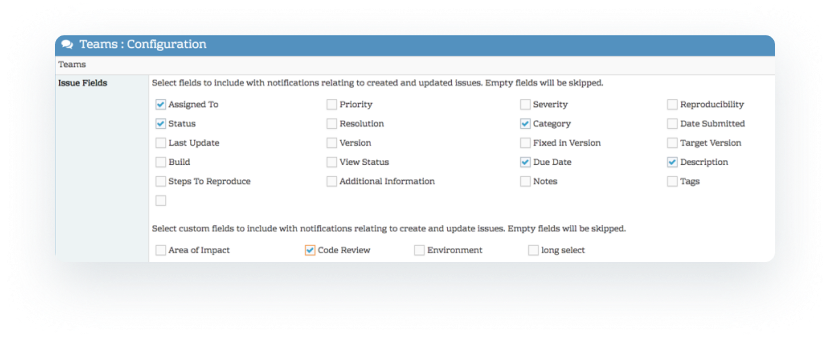

Next, paste in your generated webhook url next to the relevant MantisHub Project. For multiple mappings, you will need to create a Teams webhook for each channel/project pairing. Any project left unmapped will not broadcast any updates to Teams. 

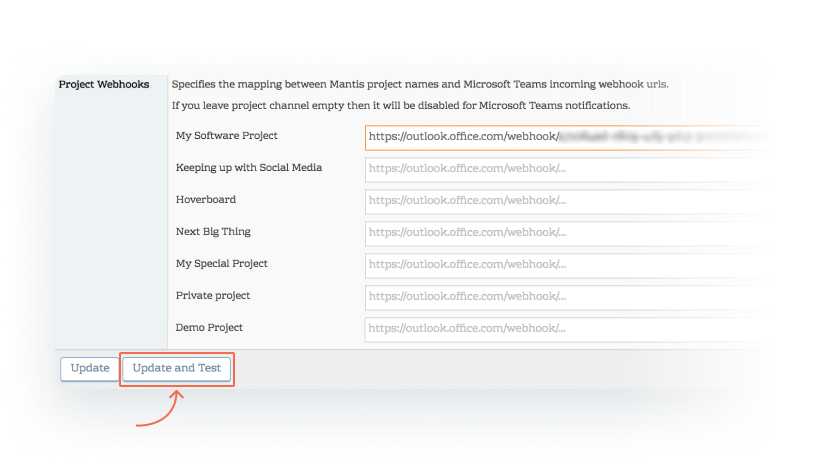

Click update and test to save the configuration and generate a test notification to Teams. A notification like the one below will be sent to the projects Teams channel.

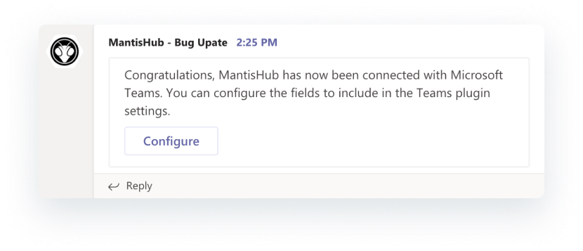

**Notifications**

You will receive Teams notification when: 

- Issues are created
- Issue status is changed
- Notes are added. For private notes, you will receive a simple notification that a private note has been added, the contents of the note will be hidden. For public notes, the note content will be included in the notification.  
- Issue assignment is changed. 
- An issue is deleted
- An issue is moved *to* the mapped project. (At this point there is no notification when an issue is moved *out* of a project)

Note that for all notifications the **Issue ID** and **Summary** will always be shown and are hyperlinked. So if you click on them it will open up a new desktop or mobile browser page directly to the MantisHub issue. 

In your MantisHub Teams plugin configuration, you will find some options in the 'Issue Fields' section. The fields chosen here will determine what fields are displayed on issue creation. It will also determine if you are notified of a change relating to these fields. For example, say you have priority checked and severity unchecked, you will receive notifications if the priority is changed but not if the severity is changed. 

Access to project notifications to a Teams channel will be viewable by all Teams users with access to the channel, independent of their MantisHub permission for access the MantisHub project/issue. However, if such users click through to MantisHub, their access will be validated.

**Examples**

Below are some sample notifications. These are updates for the 'My Software Project" MantisHub project for an issue in 'Bug' category being posted to the 'My Software Project' Teams channel. Issue fields checked in the plugin configuration includes: Assignment, Priority, Status, Category and Description.

***When an issue is created:**

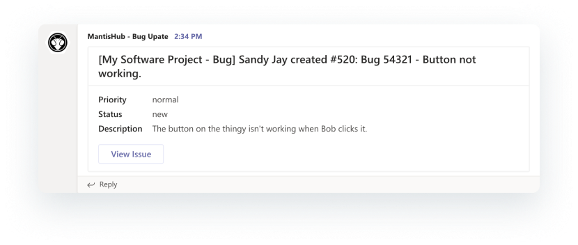

***When a team member assigns an issue to themselves:***

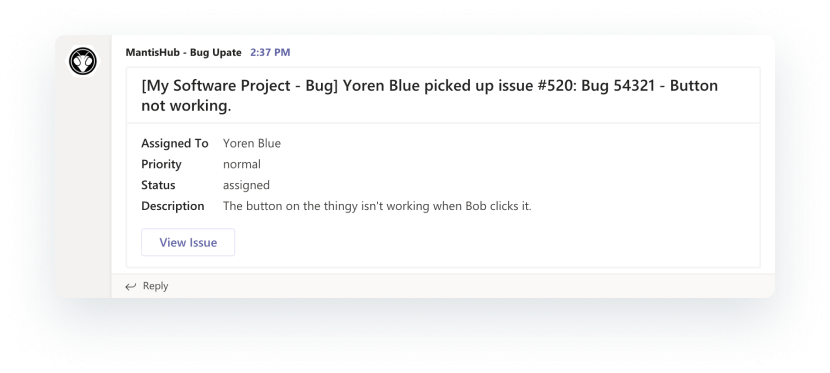

***If assignment, priority or status is changed:***

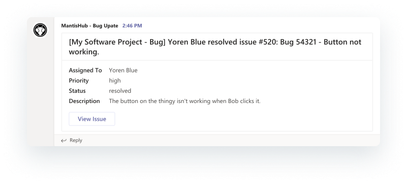

***A user adds a public note:***
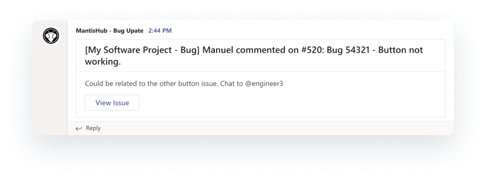

***A user adds a private note:***
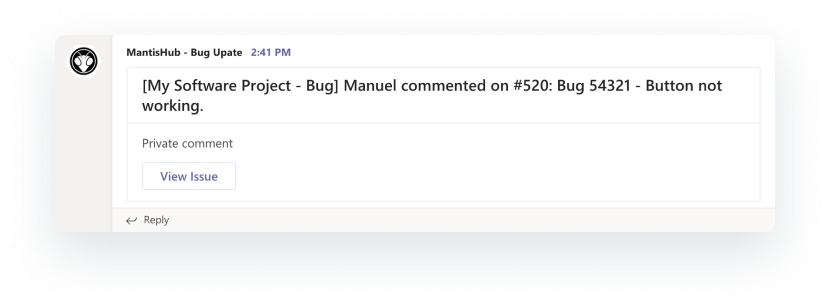
