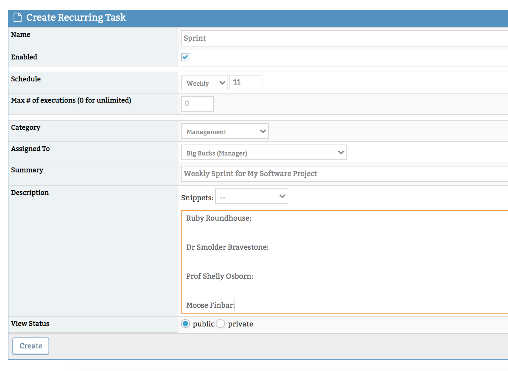

# Recurring Tasks Plugin

***Note***: *The Recurring Tasks plugin is only available for Platinum + plans*. Check out this article to [upgrade your plan](/plans_billing/switching) or reach out to our [support team](/user_management/contact_support).

Recurring Tasks allows you to automate the creation of new issues for your regular, repeating tasks. You can set tasks to run daily, weekly, monthly or annually. According to your set schedule, a new issue will be created in your chosen project with the details you've provided during setup. There is also a 'Manual' option to allow re-occurring task creation to be manually triggered. 

For example, this can be used to create a task for your weekly scrum, your monthly payroll or your annual performance reviews. An example of using a manual task could be a template issue that you would trigger for re-stocking paper for the printer.  

**Enabling Recurring Tasks**

To enable this plugin, head to *Manage -> Manage Plugins* and [install](/customizations/plugins) the Recurring Tasks plugin.

Once installed, you can click on the hyperlink to configure what minimum access level is permitted to create recurring tasks. The default setting is 'developer'.

You will now see a new menu item in your MantisHub called recurring tasks. This is where you go to create and view your recurring tasks. The feature is also available through your personal account settings by clicking on the user drop-down menu at the top right, select "My Account", then click the "Recurring Tasks" tab.

**Creating a Recurring Task**

To create a recurring task, Click the "Create Recurring Task" button. If your [project selector](/project_management/project_selector) is set to all projects then you will be prompted to select your project. If you already have a specific project set in the selector, it will be created in this project. 

Give your recurring task a name, confirm 'Enabled' is checked and set your schedule. 

*It's important to note* that when configuring your task, the timezone used will be your [personal timezone](/customizations/timezone) settings. This is usually inherited from the system default timezone unless you have specifically change your personal preferences. In such a case, it may be different from your system date and timezone set by your system administrator.

Depending on your frequency you can set tasks as shown in the below table. If you need tasks to run multiple times a period (e.g. Weekly Tue & Thurs) then you will need to create multiple separate tasks. 

Next, you can limit the number of times this task automatically executes by entering a value for the 'max # of executions' or leave this as 0 for unlimited. Finally, set your issue details including the category, summary and description. You can also set an automated assignment, this will override any category based auto-assignment.

When you're done, just click  Create.

***Handy Tip:*** *When configuring your recurring task, within the Description or Summary, you may want to make use of dynamic date fields which lets you insert the current date on creation of the recurring issue. Use the syntax "{date}" - this will insert date formatted based on short_date_format. Or use "{date:format} which inserts the date based on the format you define as detailed in: https://www.php.net/manual/en/function.date.php*

**Viewing Recurring Tasks**

Navigating back to the Recurring task menu, you will see a list of your configured tasks. Note that the timezone for displaying the task schedule is listed at the top of the table. This is your personal timezone setting. Unless you have specifically changed your timezone preference, it will inherit the default system timezone, (UTC unless your system administrator has specified a [custom system date/time setting](/user_customizations/custom_date_format).) 

Click on your task listed here to view details, edit or delete it. Instead of deleting a recurring task, don't forget you also have the option to disable the task by editing it and unchecking the enabled option. This means, no new issues will be created, but you can always re-enable it if needed down the track. 

Use the Trigger Now button to trigger your manual tasks or for your scheduled tasks, when you don't want to wait for the next scheduled execution. This will create an issue immediately using all your other recurring task settings. 

When viewing your task, you will notice a '# of executions' which shows you how many times the task has run. You can also see displayed a Recurring Task History which will list your created issues and their time of execution. 

Lastly, please note that if the user owning the tasks is disabled or the project is disabled, the recurring task won't run.