# Setting Up Source Control Integration

The Source Integration Plugin allows integrating your cloud based source control service with  MantisHub to allow linking issues to the related source control changesets (commits). Note that this integration primarily supports cloud-based source control. It does not support internal source control systems sitting behind a firewall as it relies on Source Control plugin being able to access the source control system.

Set up may vary depending on what source control system you have implemented. The below example covers integration with GitHub.

**Step-by-step guide**

**Step 1. Install the plugin:** First, install the 'Source Control Integration' plugin from 'Manage Plugins' page. Then install the plugin for specific git or svn implementation you are using (e.g. GitHub, GitLab, etc..). 

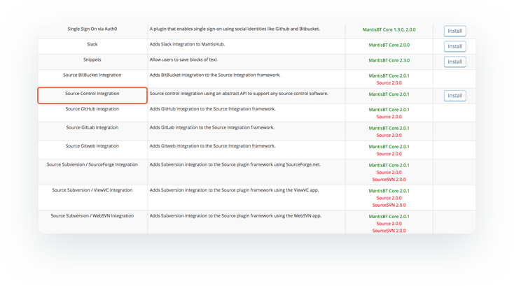

At this point the plugin is installed and active and you should see a new Repositories menu item show up in the side-bar.

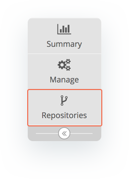

**Step 2. Create a Repository:** In order to connect existing public or private repositories, first a new repository has to be defined within MantisHub by using 'Create Repository' in the new 'Repositories' page. Simply enter a name and select your source control system, in our case that would be GitHub. Click '*Create Repository*'. 

If you are not seeing the desired system in the drop-down list, go back to Manage Plugins and make sure the appropriate plugin is installed. 

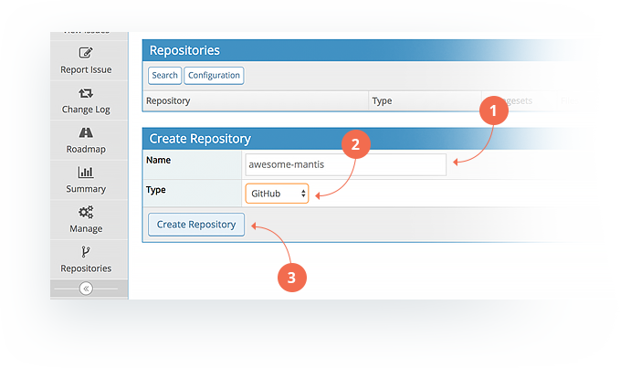

**Step 3. Configure the Repository:** You will be presented with the following screen to enter the details of your repository. This will vary depending on your repository type. But generally you'll need to configure a name, type, the URL, some form of authorization i.e. username/password or token and the branches that will trigger updates to MantisHub. Below is configuration for GitHub. 

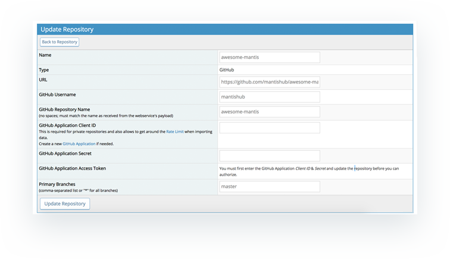

All fields are required, and the following information is expected

- **Name** - The name MantisHub uses to refer to this repository
- **Type** - Your git provider - GitHub, BitBucket, etc
- **URL** - The absolute URL of the repository
- **GitHub Username** - GitHub username
- **GitHub Repository Name** - Just the repository name, excluding user and/or organization. This needs to match the name in GitHub.
- **Primary Branches** - Comma-separated list of branches to be automatically imported by MantisHub. The default is usually 'main' or 'master', this needs to match the GitHub setup. Every time commits are fetched via MantisHub, all Primary Branches will be checked and if new commits are found, those commits will be imported.

**Step 4. VCS configuration:** At this point, we have to go back to your VCS system and setup authorization. Here's how you would do it for GitHub.

1. Go to GitHub Developer Settings: https://github.com/settings/developers

2. Create a New OAUTH App. This will present the following screen:

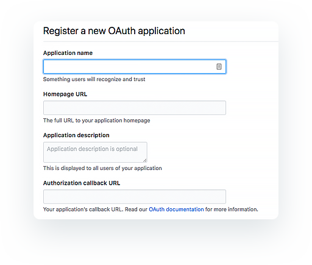

The following information is expected:

- **Application name** - Anything that you would recognize (e.g. MantisHub Source Control)
- **Homepage URL** - Anything that you would recognize, one option is your MantisHub instance URL
- **Application Description** - Anything that you would recognize
- **Authorization callback URL** - This must be your MantisHub instance URL

**3. Click on Register Application**

GitHub will give you ***Client ID*** and ***Client Secret***, which MantisHub will need to connect to the repository on GitHub.

 

**Step 5. Enter the authorization details** e.g. ***Client ID*** and ***Client Secret*** generated in the above step into the MantisHub repository configuration screen. Click '*Update Repository*'.

 

**Step 6. Authorize with your source control application.** After saving the repository setup with Client ID & Secret, you need to go back into the setup (you might already be there, otherwise click on the 'Manage' button next to the new repository in the list) and authorize your source control application. Just click on the 'Click to Authorize' button.

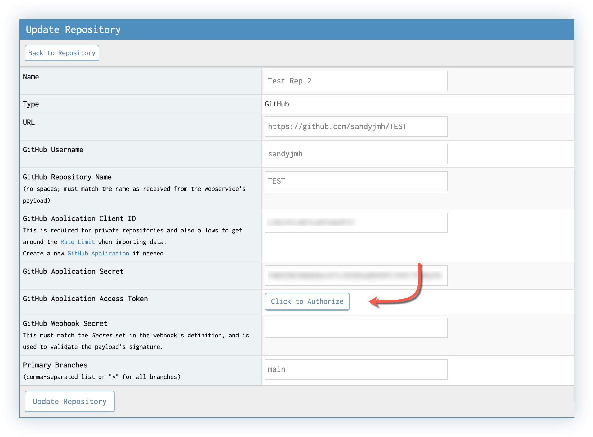

This will take you over to your SC application where you can click to authorize the connection.

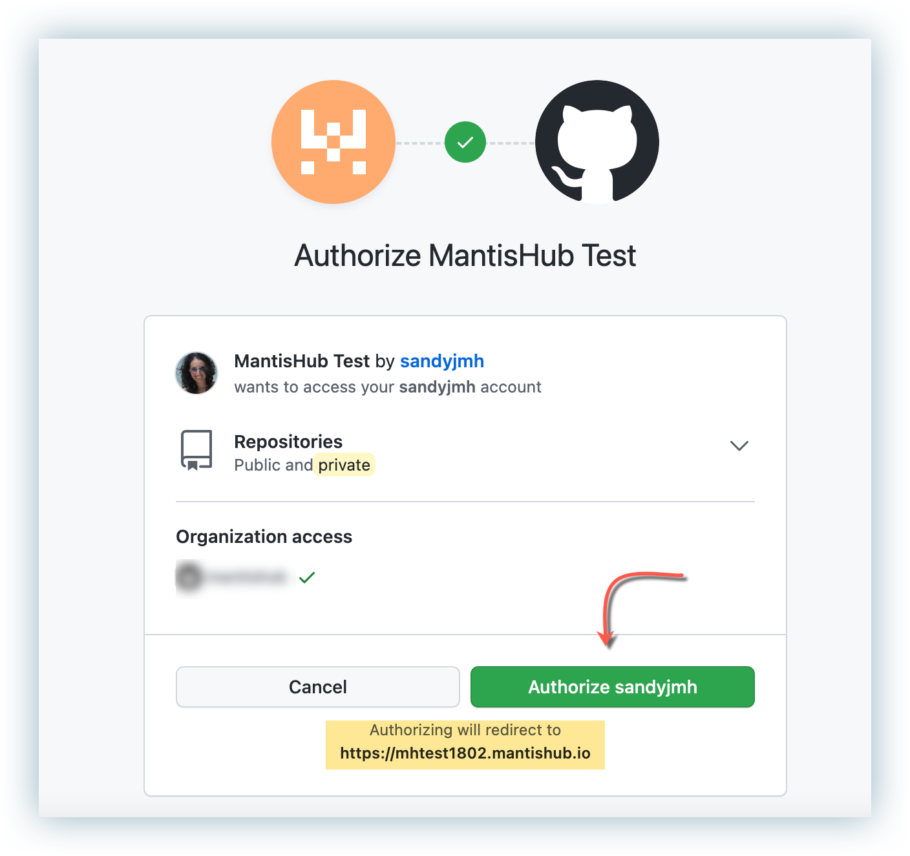

You will be redirected to your MantisHub service with confirmation of Mantis authorization with GitHub or your chosen app. 

 

**Step 7. Attach issues to Changesets:** - you can attach MantisHub issues to the changesets so that your issue is connected to a specific change found in the repository. In order to attach issue to a changeset, go to the '*Repositories*' page. Pick the changeset for your preferred repository and MantisHub will allow you to attach issues to changes.

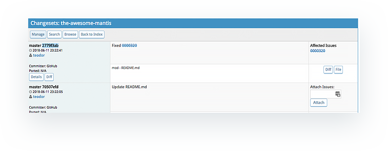

If a MantisHub issue has been referenced in the commit message, the commit/changeset will be automatically linked to that issue. If on the other hand, there is no MantisHub issue id in the commit message, the commit will not be linked to any issues. However, the user has the opportunity to link a commit to an issue manually as shown below:

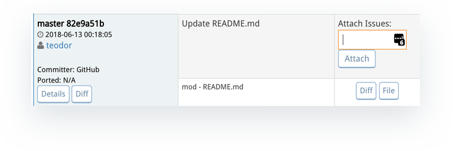

Furthermore, a commit can be attached to multiple issues. To do that, please click on **Details** button shown above. This will present a new set of configurations that the user can take advantage of as shown below: 

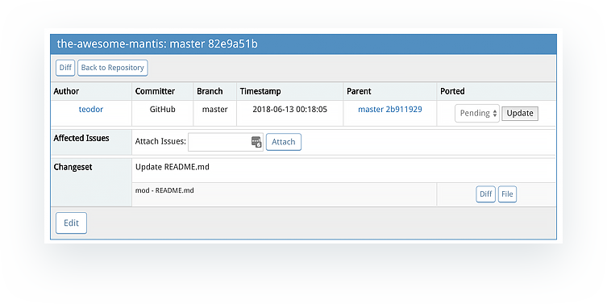

On this screen, the user can attach issues and edit/override information that has been obtained from the commit itself such as commit message, branch, author, etc.

**Step 8. Changing issue statuses and resolution via commit messages.**

By detecting keywords such as Fix, Fixes and Resolve, the MantisHub Issue numbers and its resolved status will automatically update the issue status in MantisHub. This works due to regular expressions that detect that a commit is related to an issue or resolves an issue.  These are defined in the repository configuration. To check this, go to *'Repositories' -> 'Configuration'* this will take you to the configuration page where you can see many different settings, including defining the regular expressions used to link commits to issues in MantisHub. 

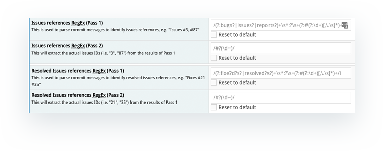

The configurations above must be made before importing information from git, if those are changed at anytime after the initial import, the changes will affect all future imports and will not retroactively update its history.

If you are making use of [Versions](/project_management/versions_mh) and wish to attribute the fixes in your GitHub to the project versions you have defined in MantisHub, you will need to map the branches to which changes/fixes are committed in GitHub to the MantisHub version. This will then update the "Fixed-in Version" issue field. This helps to know what gets fixed in which version and in the generation of your [Changelog](/project_management/project_changelog). To map your branches, Click on the **Manage** button next to your repository. Then, configure which branch maps to which release, by configuring the **Strategy**. This will tell MantisHub where to attribute your fix (to which release). 

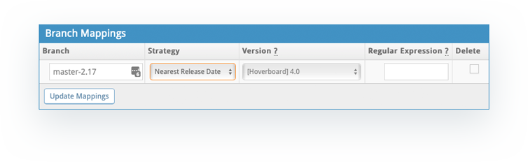

Similarly, the options above should be configured prior to the initial import of the repository as it will not retroactively update history, but only to future imports.

**Step 9. Importing Data:** You will now have a chance to import your commits into MantisHub, you could either '*Import Latest Data*' or '*Import Everything*'. This option is available by going to the '*Repositories*' page and clicking the '*Manage*' button listed next to your repository. 

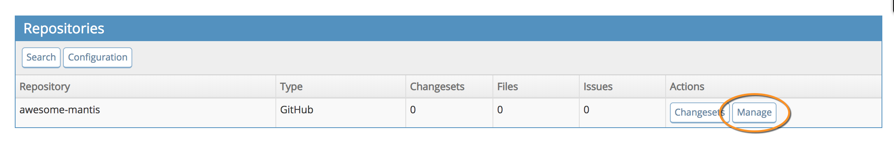

*Import Latest Data* - Imports the most recent N commits or time period.

*Import Everything* - Imports all data. This may take a long time and/or timeout if there are a lot of commits to import.

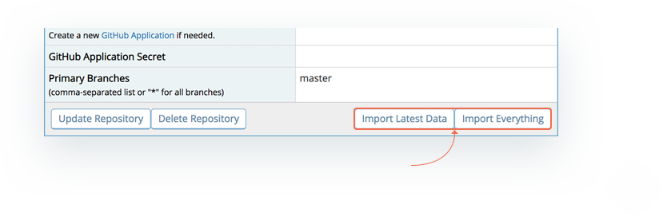

*Note*: If there is a timeout during import, you will need to re-run it as no data will be imported.  If timeout occurs, then use the import latest option.

**Setting up Webhooks**
In order to have Github actually push commits to MantisHub, you need to:

1. Create Mantishub API token,
2. Create a Webhook from within source control application. 

To generate an API token/key from your MantisHub user profile, check out our article on [Connecting to MantisHub APIs using API Tokens](/api/connecting_mh_api_tokens). 

Creating a webhook from within your repository settings will depend on your actual source control app. Below is how you would proceed if you are using GitHub.  You can read about setting up Github webhooks here:

https://docs.github.com/en/developers/webhooks-and-events/webhooks/creating-webhooks

Github will require you to put your MantisHub endpoint. This is where you will need to make use of your generated API token. The MantisHub end point will be in this format: https://< YourMantisHubName >.mantishub.io/plugin.php?page=Source/checkin&amp;api_key=&lt;< generated API token > 

For example:  https://mycompanyname.mantishub.io/plugin.php?page=Source/checkin&amp;api_key=&lt;ttdBqolosmrro_HPVZ3RoK9cOnPjgMES

 

You can see more detailed documentation on the source integration plugin via this link:
https://github.com/mantisbt-plugins/source-integration/blob/master/docs/CONFIGURING.SourceGithub.md

