# TestRail Integration for Test Management

[TestRail](https://www.gurock.com/testrail) by Gurock offers a web-based test case management software to manage, track and organize your software testing efforts. TestRail offers integration with MantisHub too including a Mantis plugin to allow you to automatically view and create Mantis tickets from within your TestRail application. 

TestRail offers a cloud-based solution as well as the option to download and self-host. For this article, we will be showing you how to integrate the cloud solution with your MantisHub service. Steps for integration with a self-hosted option will be very similar. 

Once you have set up a TestRail service including the creation of your projects and test cases you can set up your integration to record the results of your test runs. TestRail provides two ways to integrate with MantisHub, Defect URLs & the Defect Mantis Plugin. 

**Defect URLs**

Defect URLs provide a link to your MantisHub. It allows you to simply enter in an issue ID and create a live hyperlink to your MantisHub Issue details. These links can be added to test run results and can be used to directly navigate to the issue details or you can hover over these links for an update on issue status.

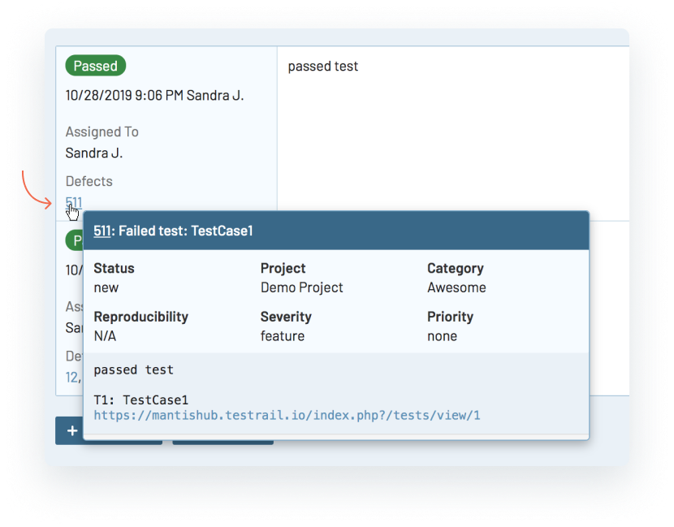

It also provides an 'Add' link to the Report Issue page where you can manually create a new ticket within MantisHub.  

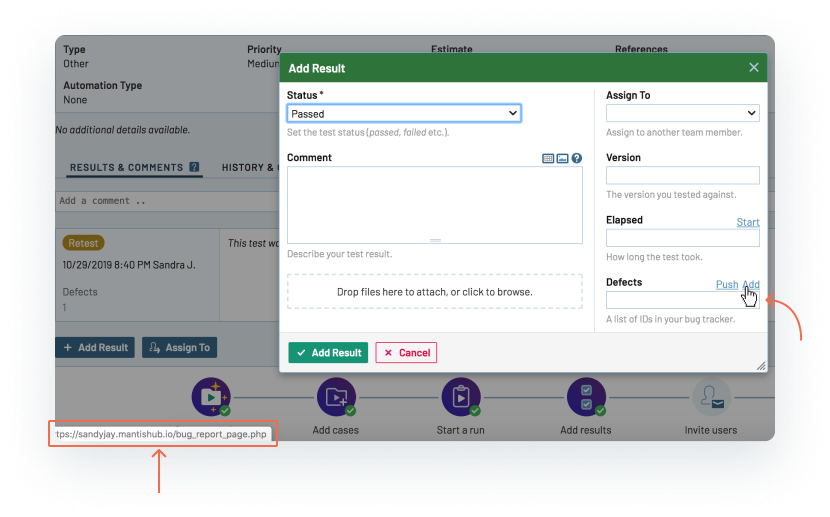

You can configure this as a global setting or on a per-project basis. To configure this globally, [within your TestRail app](http://docs.gurock.com/testrail-integration/defects-urls), go to "Administration -> Integration". Configure the following:

1. **Defects View URL** for your live hyperlinks. This is the web address of your bug tracker to view a case. Enter https://companyname.mantishub.io/view.php?id=%id% where 'companyname' is your personal MantisHub name and URL e.g. https://mygreatsoftware.mantishub.io/view.php?id=%id% . The %id%  is the placeholder for the ID number you enter into your TestRail test run results. 

2. **Defect Add Url** for your 'Add' link. This is the web address of your Report Issues page to add a new issue. Enter https://companyname.mantishub.io/bug_report_page.php where 'companyname' is your personal MantisHub name and URL e.g. https://mygreatsoftware.mantishub.io/bug_report_page.php 

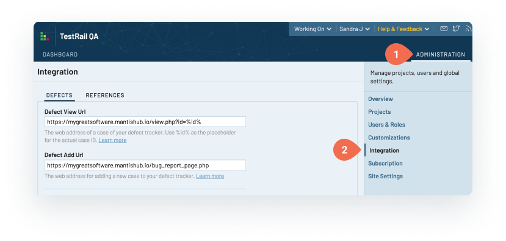

**Project Configuration**

To configure the Defect URLs or your Defect Plugin at a **project level**, enter into the Project settings and select the Defects tab. Then enter the specific project level defect view & add URLs. 

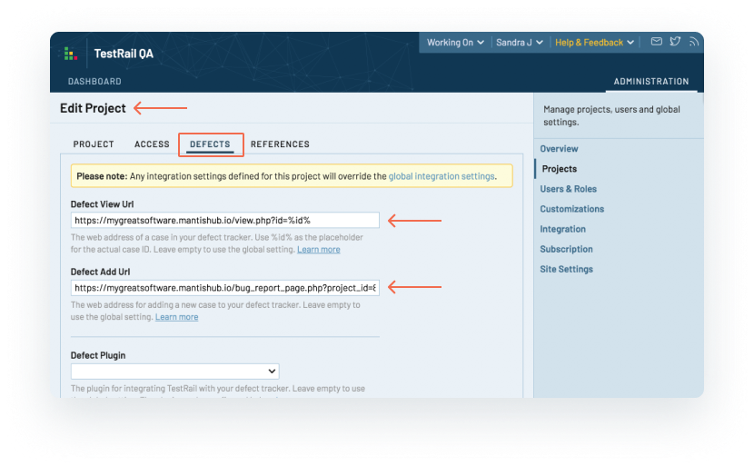

Note that using the default bug report page for the 'Add URL' will take you to the report issues page within the project that you currently have set in your project filter. This may not correspond to the project you wish to report your test run results in for a specific project. What you can do here is specify the project ID in your Add URL. To do this, the end of the 'Add URL'  you would need to add "?project_id=n"  where 'n' is the project ID for your required project. For example  https://mygreatsoftware.mantishub.io/bug_report_page.php?project_id=8

You can find out the project id from within your MantisHub by going to the ‘Manage’ page and selecting the ‘Manage Projects’ tab. Click on the required project and look at the id number displayed in the URL. In this example, it’s 8.

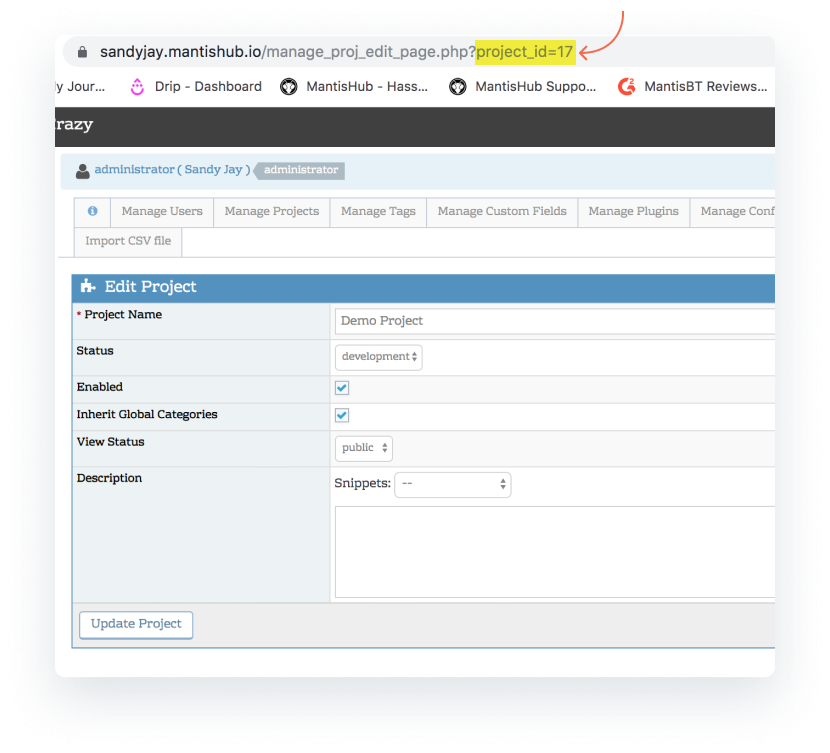

**Defect Mantis Plugins**

You can set up the [TestRail Mantis plugin](http://docs.gurock.com/testrail-integration/tools-mantis) either within the global TestRail settings or with the project. You can have both these configured as well if, say you want a default integration setup to one MantisHub service but maybe need a different setup for specific TestRail projects. Any project settings will override the global configuration and if any project settings are blank, then the global setting will be used. 

For global settings, head to "Administration -> Integration" in your TestRail application. In the Defects tab, scroll down to Defect Plugin and select 'Mantis' from the dropdown list. 

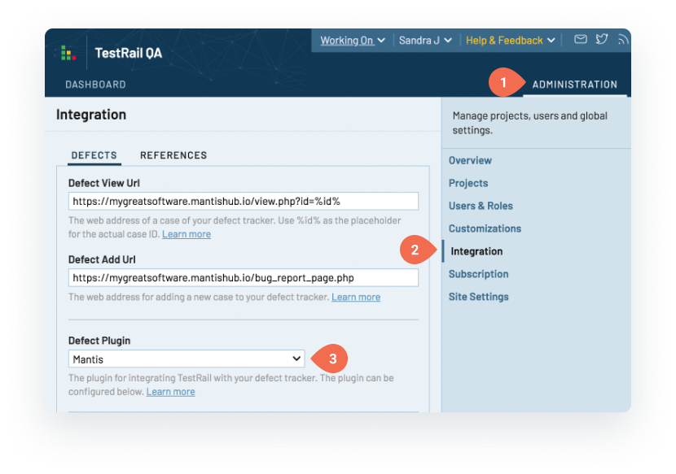

You now need to configure your connection. In the address field, enter your MantisHub URL. 

For the username and password field, you have a couple of options. 

**1. Creating a dedicated 'testrail' user.**

Select a MantisHub user for reporting of TestRail issues. We recommend you create a new user with username 'testrail' with reporter access level. Don't forget they will need to be added to any private projects you wish to generate issues for. You can create the 'testrail' user without an email address for added security and administrators can [impersonate](/user_management/imperson_users) the account for access. From within the 'testrail' user account, [create an API token](/api/connecting_mh_api_tokens). In your TestRail plugin configuration, enter 'testrail' for the username and the newly created token for the password field. All 'pushed' defects will be created under the testrail user account.

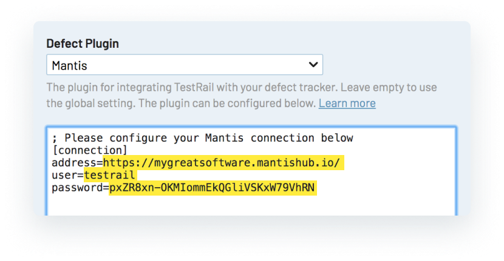

**2. Using User Variables**

Your second option is to create user variables and allow each TestRail user to set their own MantisHub username and password in their TestRail user settings. Using this solution means that the 'reporter' of the MantisHub issue will be set to each individual user rather than a generic user.

To configure this, you must define user variables for the username and password fields. You'll see a link to 'Add User Variable' just below the Defect Plugin section, at the bottom of the page.

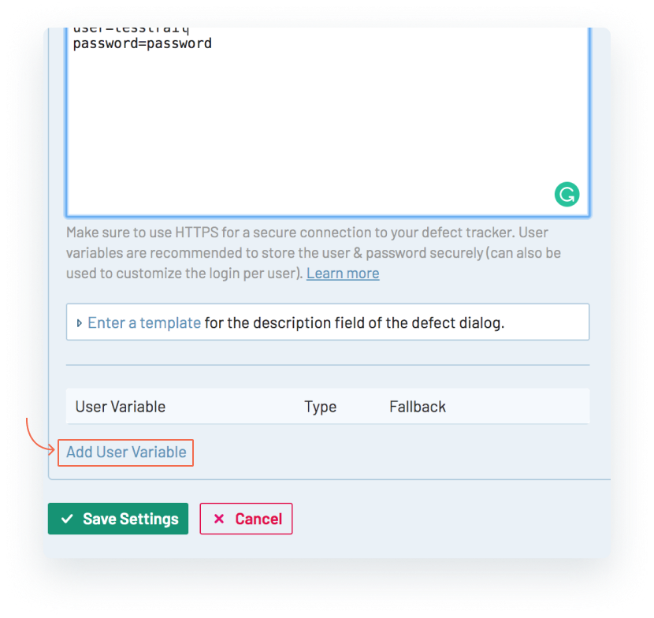

Click this link to create a variable for your MantisHub username and enter your variable details. Required fields include:

- **Label**  - this should be meaningful to users e.g. 'MantisHub Username' as it will be displayed in the user interface under My Settings.

- **System Name**  - for use as a placeholder e.g. 'mantisname' and

- **Type** - for username this will be string. 

Optionally, you can also configure a **fallback** or default value for users who have not defined their username. This is where a 'TestRail' user will still come in handy. But you may elect to leave this blank which will force your TestRail user to have valid credentials to be able to push MantisHub issues. 

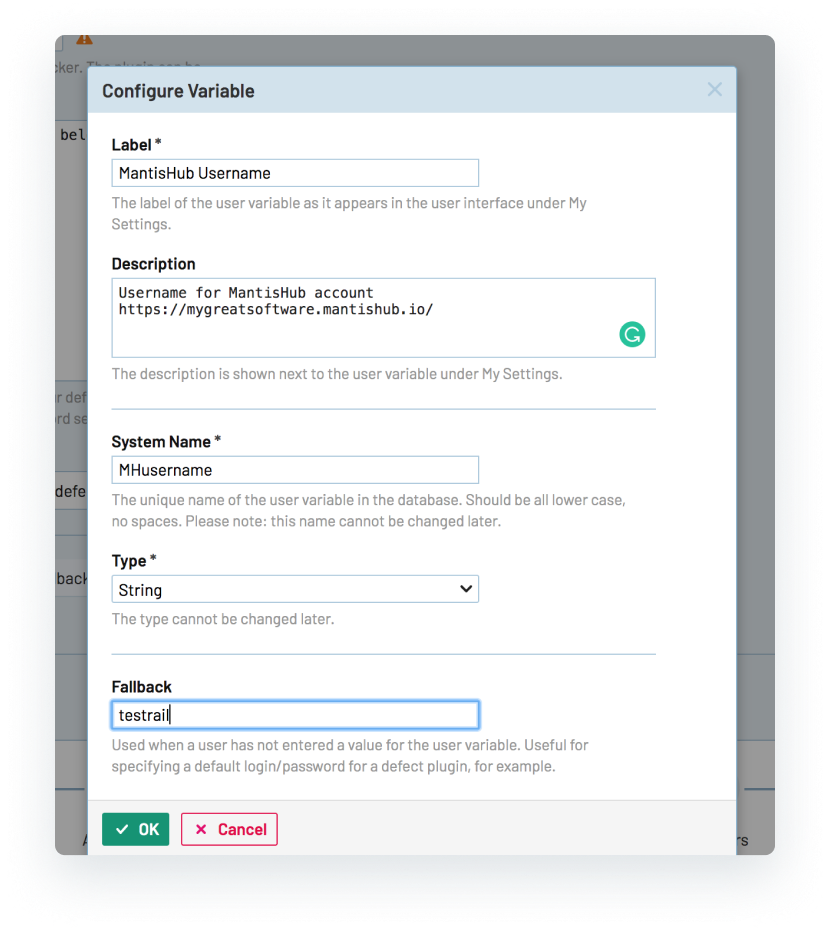

Repeat the above steps for the %password% user variable, the **Type** field will be *password*. 

Once the User variables are configured, you will need to set the Plugin configuration to the new variable placeholder. This will be the system names preceded and followed by a '%' e.g. username=%mantisname% 

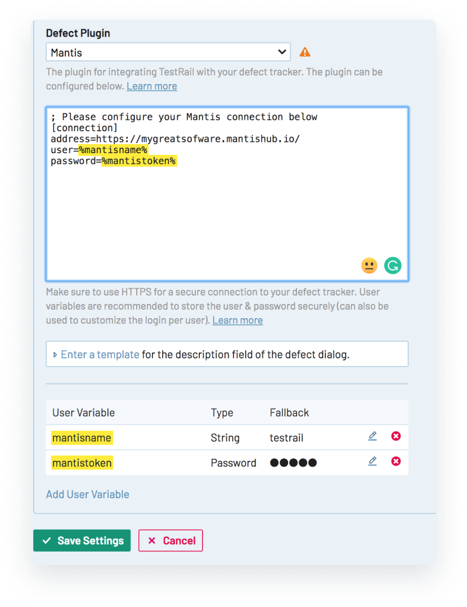

Lastly, your TestRail users will need to update their MantisHub name and password/token in My Settings. 

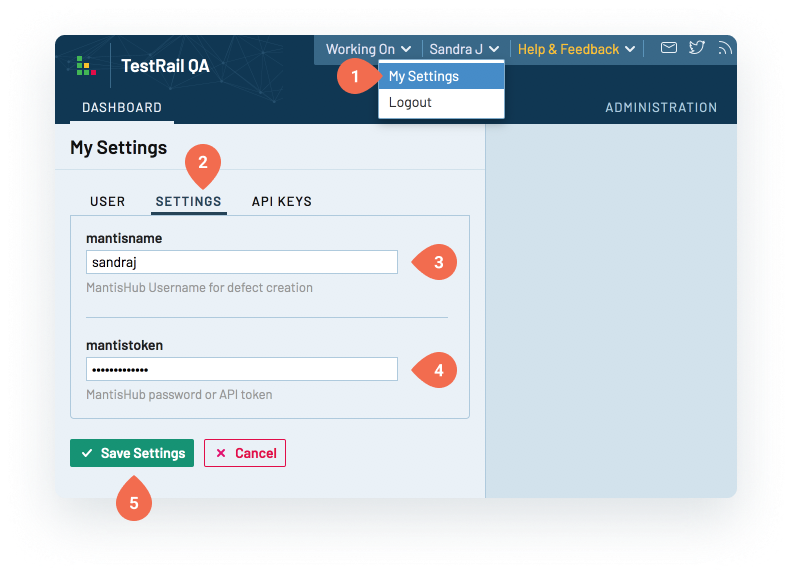

After installing and configuring the Mantis defect plugin, you'll see a 'push' option when entering test run results.

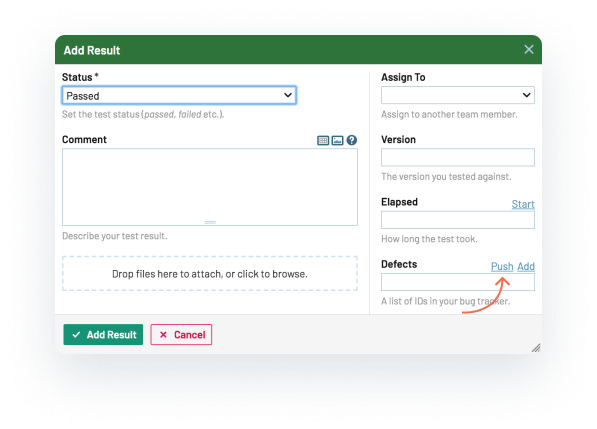

Click this to enter detail for your MantisHub issue. Default values presented are shown in the screenshot below. The plugin sets these fields to be required so you will need to populate all fields. If you do not have these fields in your MantisHub service, enter any value and continue, this will not affect the creation of the new issue. 

Self-hosted TestRail offer other customization options detailed [here](http://docs.gurock.com/testrail-integration/defects-plugins-examples). Or you can build a whole new [custom plugin](http://docs.gurock.com/testrail-integration/defects-plugins-custom) integrating with [MantisHub's REST API](/api/mh_rest_api).

If you are after further customization option with your TestRail cloud solution, please reach out to the Gurock/TestRail team. We are happy to work with them if needed to deliver a solution. 