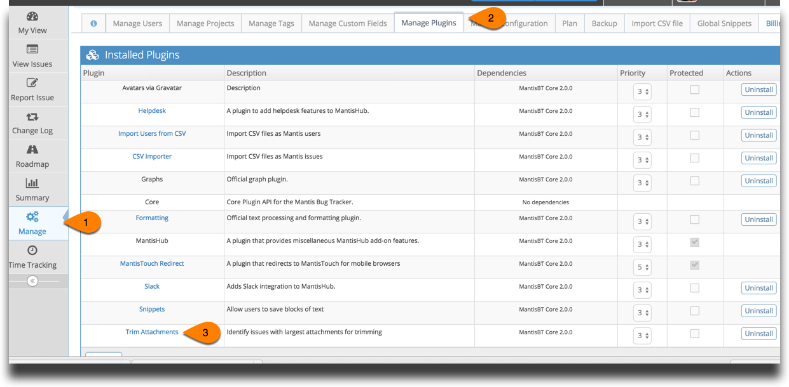
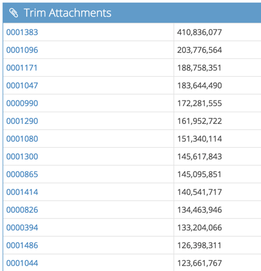

# Trim Attachment Plugin

For customers looking to bring down their storage, MantisHub has a plugin available to list closed issues with large attachments. 

Simply install the 'Trim Attachments' plugin by going to 'Manage' - 'Manage Plugins'. You'll see it listed in the Available Plugins. Click Install.

To run the report, go to 'Manage' - 'Manage Plugins' and click on the 'Trim Attachments' Plugin

The plugin will provide a list of closed issues that have attachments sorted by issues with largest attachments at the top. You can then click on the issues and delete the attachments. 

