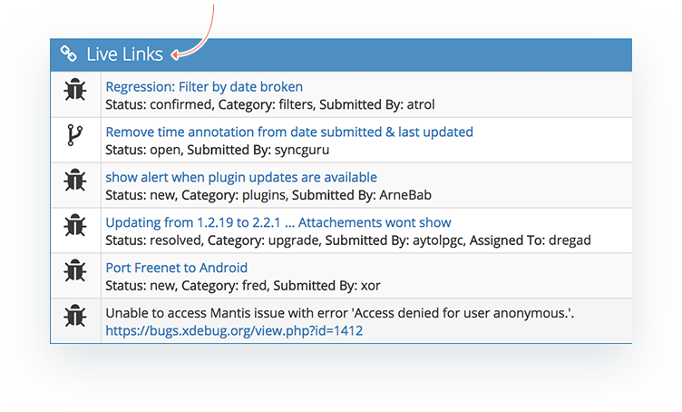
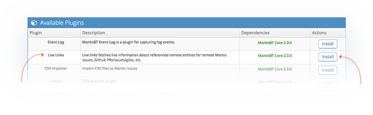
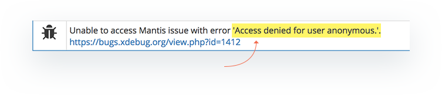

# Tracking Upstream Issues via Live Links

At times, issues MantisHub has dependencies on 3rd party components (e.g. open source libraries). So there is a need to track remote issues or pull requests that are related to the issue. This is where MantisHub's Live Links plugin comes in handy.

Live links supports links to:

- Github Issues
- Github Pull Requests
- Github Gists
- MantisHub Issues
- MantisBT Issues

You can think of these links as similar to the relationships, but are to remote repositories.  Live Links plugin fetches information about the referenced remote entities and displays up to date information within the context of the referencing issue, just under the relationships section. 

Live Links will check any URL added in your issue Summary, Description, Notes or Additional information fields and if a supported remote link is detected, will automatically populate the remote issue information in the Live Links section. 

Information fetched from the remote entity includes Status, Category, Reporter and Handler. The information is cached for up to an hour and will be refreshed when the issue is accessed and the cache has expired. 

 
To install the plugin head to 'Manage' - 'Manage Plugins'. You'll find the Live Links plugin in displayed in the 'Available Plugins' section and you just need to click 'Install'  

By default, github.com as remote entity is enabled, so straight away, links to GitHub issues, pull requests and gists are detected. Other MantisBT providers can be added by emailing the remote url to our support team to have this configured for you.

However, you'll need to note that if the remote provider does not have anonymous access enabled via API, you'll get an error message displayed in the live links section. 

