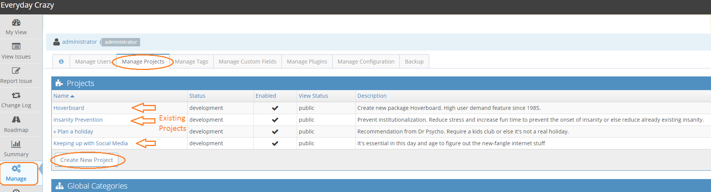
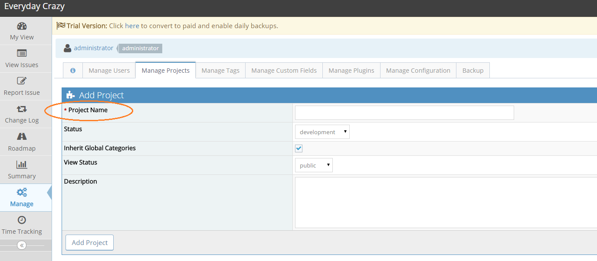

# Creating Projects

[Video Tutorial](https://youtu.be/yrWnjOu2i6U)

<iframe width="560" height="315" src="https://www.youtube.com/embed/yrWnjOu2i6U?si=2TIwfFbrQV1bV3Ez" title="YouTube video player" frameborder="0" allow="accelerometer; autoplay; clipboard-write; encrypted-media; gyroscope; picture-in-picture; web-share" referrerpolicy="strict-origin-when-cross-origin" allowfullscreen></iframe>

To get started using your MantisHub, you need to first create a project.  A new MantisHub starts off with a pre-created project named 'My Project'.

This may be all you need but if in the future, if you want to add more projects or manage existing ones, you should:

- Login as administrator
- Go to the 'Manage' menu
- Select the 'Manage Projects' tab

To create a new project click the 'Create New Project' button. To edit existing projects, click on the the project name from the displayed list.

When creating a project, the Name is the only Mandatory field.

There are several other fields that you may wish to specify. Check out the [Project Configuration](/project_management/project_config) article to get more information on them. 

Project fields can be updated by users with access level MANAGER or above. 

**Public vs Private Projects**
 
If a project is defined with 'View Status' public then it will be accessible to every user in your MantisHub. They can access the project according to their global access level, unless you add them explicitly to the project with a different access level. In this case, the access level defined at the project super-cedes their global access level for this project. 

Private projects are only accessible by users specifically added to the project. As with public projects, this can be different to their global level and is specific to the project. 

Note that users who have ADMINISTRATOR global access level have access to all features and projects in MantisHub.  Hence, you can't limit administrators to just a subset of projects or restrict their access level within specific projects.

