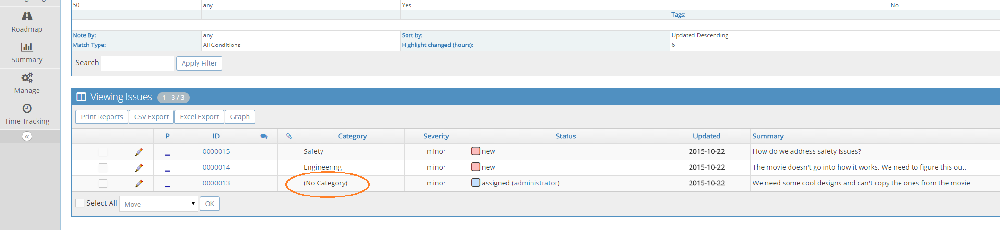

# Managing Categories

Once you've created you projects you'll want to classify Categories. This allows you to divide up your issues into specific areas like 'user interface', 'backend', 'marketing' etc. This could be based on the type of issues, the feature areas within your software or the expertise of your various development teams. 

You can have categories that are specific to a project or defined globally across all projects.

You’ll have a pre-defined global category called 'General'. This is used as your default category moving issues between projects where the source category doesn't exist in the target project. As well as the category used when [reporting issues via email](/mantishub_helpdesk/report_email) so we strongly recommend that this category is **NOT** deleted. If however, it is deleted accidentally, you will need to re-create it and then follow the steps in this article ['Changing default category'](/project_management/change_default_catgs), to correct it.

**Creating Categories**

You can add new global instances from the 'Manage Projects' tab on the 'Manage' page.

Your specific project categories are set in your project configuration.

In this screen, you can also copy categories from and to other projects. 

*Handy Tip*: For both configuration methods, you can create multiple projects at once by using the pipe '|' character. For example, type "User Interface|Backend|Marketing" and click Add category. You'll get 3 categories called User Interface, Backend and Marketing created.

**Configuring Categories**

Categories can be configured to have a default handler. This means all issues reported against a specific category can be automatically assigned to a team member. 

**Deleting Categories**

If a category is deleted, MantisHub will provide a warning that there are issues still assigned to it.

If you choose to continue to delete the category, the issues will become listed as having no category.

If you wish to avoid this you can filter your issues via the 'View Issues' page (don't forget that closed issues are hidden by default). You can then 'Select All' and update the category.

