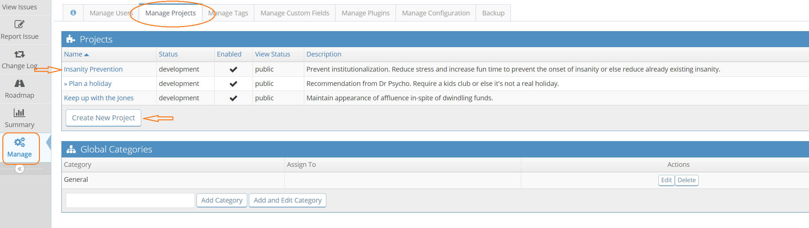
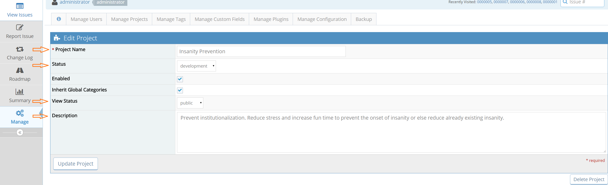
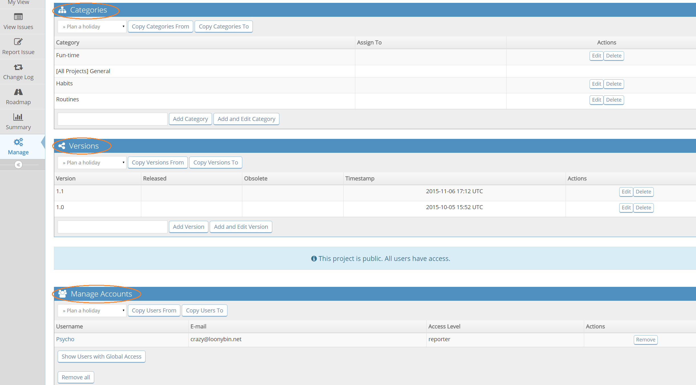

# Project Configuration

[Video Tutorial](https://youtu.be/yrWnjOu2i6U)

<iframe width="560" height="315" src="https://www.youtube.com/embed/yrWnjOu2i6U?si=eREWNm_kQcM2neb8" title="YouTube video player" frameborder="0" allow="accelerometer; autoplay; clipboard-write; encrypted-media; gyroscope; picture-in-picture; web-share" referrerpolicy="strict-origin-when-cross-origin" allowfullscreen></iframe>

Projects can be configured via your 'Manage' page (Note: you may need to authenticate here).

From there select the 'Manage Projects' tab. You can either create a new project here or click on the existing project listed to update it. 

There are several fields you can update:

- **Name** - the project name.

- **Description** – a brief description of the project.

- **Status** - the maturity or development status of the project. This is informational and won't affect MantisHub functionality.

- **View Status** - whether the project is viewable by all users that can login to your MantisHub (public) or private. Private projects are only visible to users who are assigned to it or to administrators.

**Categories** - these are used to sub-divide the issues reported in the project (e.g. UI, database, backend, etc). You can have categories specific to a project and you can also have global categories but these are defined outside the project. 

**Versions** – Project versions are used for all version related fields in issues i.e. 'Product Version', 'Target Version' & 'Fixed In Version' (see [Versions in MantisHub](/project_management/versions_mh) for more information). This allows creation of ChangeLog & Roadmap reports (see [Project Changelog](/project_management/project_changelog) & [Project Roadmap](/project_management/project_roadmap) for more information). They can also be used to filter issues (i.e. show all blocking issues for version 2.0). Version fields (i.e. 'Product Version, etc.) *will not appear* within an issue unless you have created Versions (i.e. 1.0, 2.0, etc.) within your project. 

**Manage Accounts**: 

Here you can manage user account for private projects. It lists users that can access the project and their access level. You can use the control/command key to select and add multiple users at once.

The access level assigned here can be different to previous definitions. Hence, a user who has a global access level of DEVELOPER, could be a REPORTER or MANAGER in this specific private project. In public projects, the same field can be used to override the globally defined access level. Check out [Creating user accounts](/user_management/create_user_accounts) for more information. 

