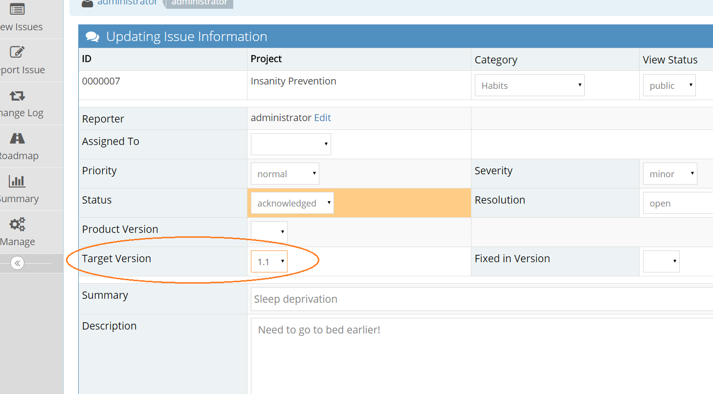
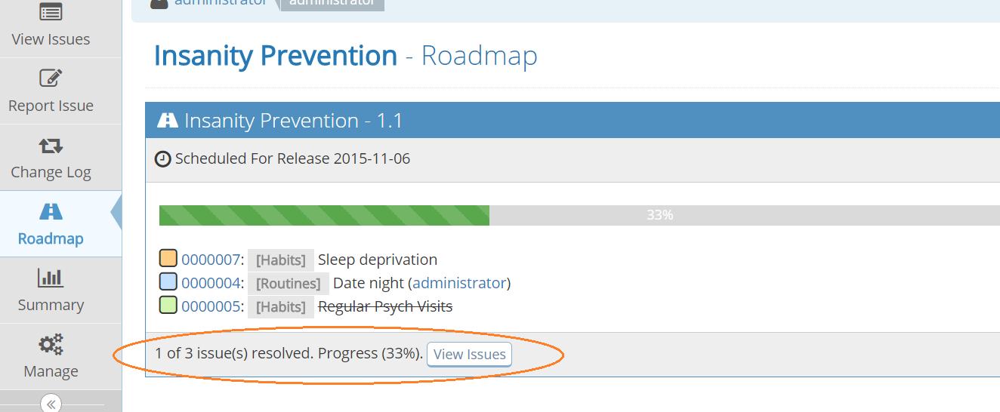
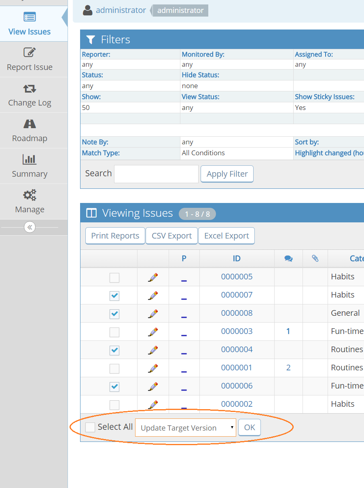

# Project Roadmap

[Video Tutorial](https://youtu.be/XchPYlYIE1s)

<iframe width="560" height="315" src="https://www.youtube.com/embed/XchPYlYIE1s?si=gM8S8A-Zx2PEbvpU" title="YouTube video player" frameborder="0" allow="accelerometer; autoplay; clipboard-write; encrypted-media; gyroscope; picture-in-picture; web-share" referrerpolicy="strict-origin-when-cross-origin" allowfullscreen></iframe>

The Roadmap page allows you to set scope, milestones and track progress in your projects. The Roadmap will show you upcoming [versions](/project_management/versions_mh) and the issues that have been targeted to be fixed in these versions. This is very useful information to provide to your team and users. It can also help with prioritizing issue assignment.

The Roadmap page is automatically populated once issues are assigned a "Target Version"

Only versions that are not yet released will appear in the drop down list. And of course make sure your project has versions information defined. Check out [Project Configuration](/project_management/project_config) on how to do this.

Once a project version has issues targeted, it will appear on your Roadmap page. As well as listing the issues, the version Roadmap information displays up to date progress. You can see the number of issues to be addressed, how many have been completed and a percentage progress.

If there are no issues assigned a target version, it will not appear in your Roadmap, nor will versions that are marked as "Obsolete".

Resolved issues appear displayed with a strike through, and if the "Fixed in Version" field is also set, it will appear in your Changelog page. You can read more about this in [Project Changelog](/project_management/project_changelog).

*A handy tip*: You can set the "Target Version" field for multiple issues at once by using the group action on the "View Issues" page. This option is only available when the selected project is not "All Projects".

To modify which users have access to your Roadmap you will need to add a configuration option. 

Go to 'Manage' - 'Manage Configuration' - 'Configuration Report' - scroll down to 'Create Configuration Option,' then enter the following details:

username: 'all users'

project name: 'all projects'

configuration option: 'roadmap_view_threshold'

type: 'integer'

value: (Enter the access level code for the minimum [access level](https://mantisl.ink/access-levels), e.g., 55 for developer and above or 100 to hide it from everyone.)
