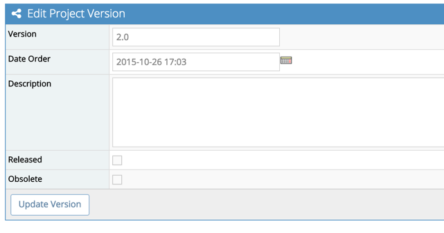

# Versions in MantisHub

If you're using MantisHub to manage your software projects you probably already realize the importance of versions (also known as releases).  

Typically software project updates are organized into several versions setup in your [project configuration](/project_management/project_config). Versions can be named numerically such as 1.0, 1.1 or may be based on release dates for services, e.g. '20151020'. Versions are used for all version related fields in issues but note that **these fields will not appear within your issue unless you first create a version in your project**.

When [reporting or updating](/issue_management/report_issue) an issue, the following version fields may apply: 

1. ***'Product Version'*** showing in what version the issue was discovered by the reporter or the version in which the issue was introduced.

2. ***'Target Version'*** showing in what version to aim to have this issue fixed or implemented.  This automatically populates the project [Roadmap](/project_management/project_roadmap).

3. ***'Fixed-in Version'*** showing in what version this issue was fixed or implemented by your developers. This automatically populates the project [Changelog](/project_management/project_changelog).

Versions are ordered by the planned/actual release date assigned to it (this will be the date you first added the version unless you specifically edit the Version's Date Order). The version can also be defined as:

***'Released'*** - this version is released and you can no longer set it as a target version for an issue.

***'Obsolete'*** - this version is obsolete and you can no longer use this version in your version related fields within an issue.  Obsolete versions won't also be included in the [Changelog](/project_management/project_changelog).

 
Go to 'Manage' - 'Manage Projects'. Click on the project name and scroll down to the 'Versions' section. Click the 'Edit' button, next to the version you wish to edit. 

