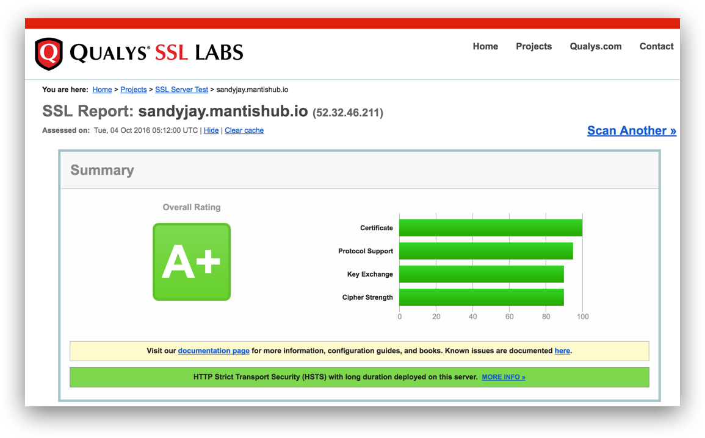

# MantisHub Security

MantisHub has been rated A+ from 3rd party security evaluators so we can assure our customers that MantisHub delivers a high level of security 

If you need further details on our security measures we've addressed the most frequently asked questions below:

**Application Security**

MantisHub is always running latest version of MantisBT along with all security patches and new features. Servers hosting MantisHub do not run any other applications and don’t run any kind of custom code or plugins that are provided by customers.

**Two-Factor Authentication for our Users**

MantisHub enables customers to deploy two-factor authentication for their users by utilizing our federation with services like Azure AD, Google Suite, Github and Bitbucket.

**Two-Factor Authentication for our Team**

Services used for MantisHub hosting and related SaaS services that we used for operations are all configured for our team members to use two-factor-authentication.  That ensures protection of our hosting environment and client data.

**Server Security**

MantisHub patches its servers on a weekly basis. For high profile vulnerabilities (i.e. hartbleed) servers are patched as soon as the fix became available.

Access to server is authenticated using PKI keys rather than usernames and passwords providing higher level of security.

**Encryption on the wire**

All communication to MantisHub happens via HTTPS leveraging SSL for data encryption over the wire. Our SSL server configuration and security has been rated as A+ by 3rd parties that assess server security.

**Encryption at REST**

All hosted data is encrypted at rest.

**Privacy**

We value our customers privacy. We don’t share or sell your data in any way. Customer data is accessed by our support team for the purpose of providing support to our customers. Such access is audited. See more details in our [private policy](https://www.mantishub.com/privacy-policy)

**Data Retention**

Customer MantisHub data is only used and retained to service our customers and their users. In case of cancellation all MantisHub data and backups are purged within 30 days.  A customer can also request that their data be deleted effective immediately.

**Business Continuity, Backups and Disaster Recovery**

We run daily backups to protect against failures or corruption. Customers are able to download backups of their data at any time so customer data is easily transportable if you decide to stop using the service.

We have a distributed team across US, Asia and Australia. MantisHub runs on AWS servers located in US and EU, which helps with redundancy and recovery.

MantisHub have been in business for 10 years, but in the unlikely event of liquidation, customers own their own data.

**Data Isolation and Export**

MantisHub data for each customer is isolated into its own database. This providing added security and isolation. This also enables customer initiated backups and export of all data if they decide to stop using MantisHub.

**Penetration Detection**

MantisHub services are protected using penetration detection services that audit all our servers and logs.  Such service would highlight and alert on potential security improvements or any suspected attacks.

**Hosting Environment**

All servers are hosted in AWS cloud. We have server clusters located in US region and in the EU. Your service can be hosted within a specific region on request. 

**SLA**

We provide 99.9% availability SLA for MantisHub.

**Payment Method Security**

We use a third party service for payment processing (Stripe). All your payment method details are stored in a secure vault within Stripe. MantisHub service and team never get access to your payment details, we simply get a token that enables charging your payment method.  The invoicing service (Maxio) manages the invoicing but doesn't have access to payment info.

**Money-back guarantee**

If a customer is not satisfied with our service, we provide a money back guarantee for any payments collected within the last 30 days.

**Terms of Service**

See our detailed [terms of service](https://www.mantishub.com/terms-of-service).