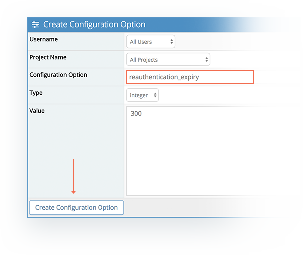

# Authentication Timeout

As a security feature, MantisHub will ask for re-authentication when a user attempts to access administration settings (Manage) or personal settings (My Account).  By default re-authentication is triggered if user hasn't explicitly signed in (provided credentials) within the last 5 minutes.

Accessing regular MantisHub pages for managing issues doesn't trigger such re-authentication.

It is possible to change the timeout setting or turn off re-authentication altogether via a configuration option. Just head to *Manage - Manage Configuration - Configuration Report* and create a new configuration option as below:

 **To enable or disable re-authentication**: 

**Username**: *All Users*

**Projects**: *All Projects*

**Configuration Option**: *reauthentication*

**Type**: *integer*

**Value**:                              *0 - to disable, 
        1 - to enable*

**To adjust re-authentication timeout duration:**

**Username**: *All Users*

**Projects**: *All Projects*

**Configuration Option**: *reauthentication_expiry*

**Type**: *integer*

**Value**: <time in seconds - default setting is 300> 

 