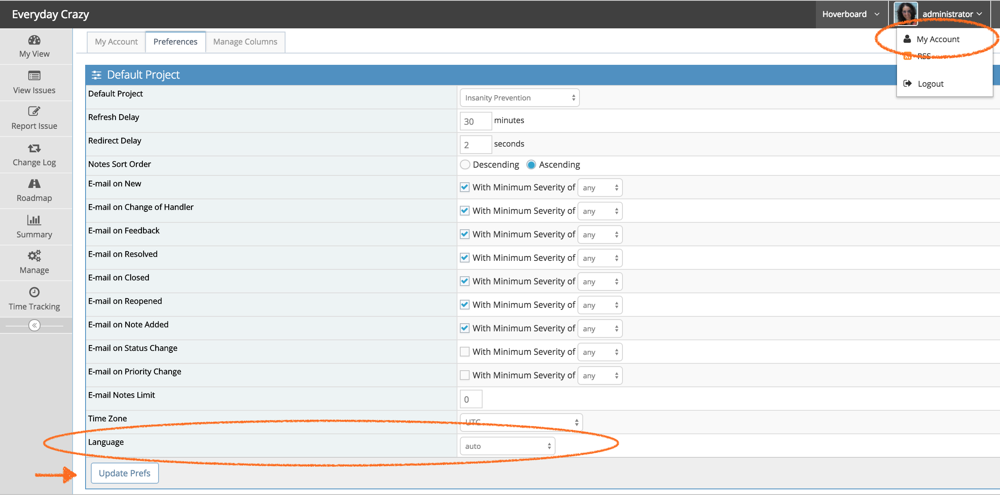
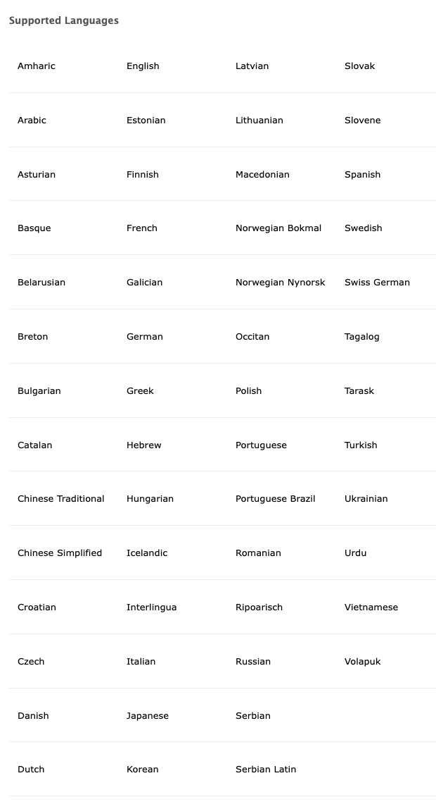

# Changing Language

MantisHub is used across the world and can be viewed in over 60 languages.

To change your language preference, simply go to 'My Account' via the dropdown box in the top right corner of your screen. Then select the 'Preferences' tab.

Select your language from the dropdown box and click 'Update Prefs'.

You can also override the default language for your MantisHub by emailing our support team and we'll set it up for you. Any new users to your MantisHub will have their MantisHub displayed in your nominated language. Existing user will still need to manually change their language preference as above.

