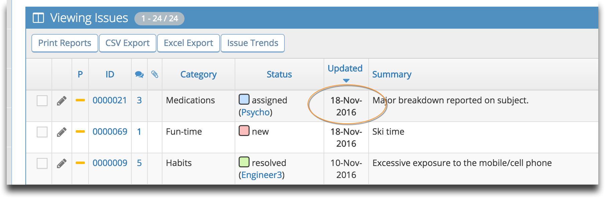
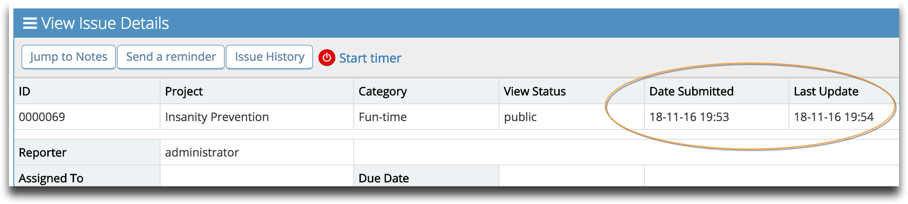
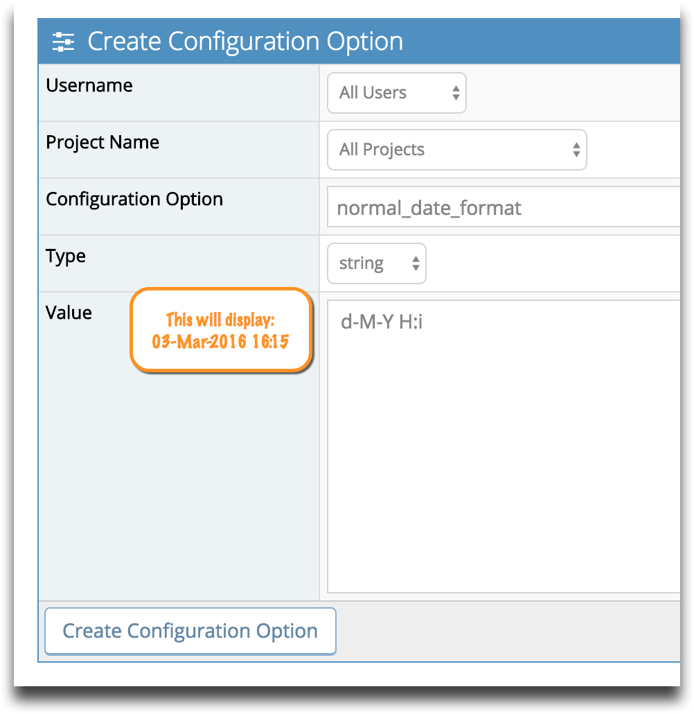

# Customizing Date Format

By default MantisHub uses Year-Month-Day 24hr time format when displaying time fields in your issues. However it is possible to customize your date format.

To configure the date this, go to Manage - Manage Configuration - Configuration Report and add the below configuration options with your preferred date string. You can use the documentation on the following page to get the string for the date format that you desire: http://php.net/manual/en/function.date.php

`All Users, All Projects, short_date_format, string, <date string e.g. d-m-y>`

`*` Short Date will appear on your view issues page and your data exports.

`All Users, All Projects, normal_date_format,<date string>`

`*` Normal date appears in issue fields and notes.

`All Users, All Projects, complete_date_format,<date string>`

*Warning: When customizing the normal_date_format, you will also need to update the configuration for your datetime_picker_format to **match** the new normal_date_format. If this is not set, then the behaviour of your datetime picker will be unpredictable. Datetime picker is used for changing your version date and your Due date. See this link for datetime_picker_format syntax https://momentjs.com/docs/#/displaying/format/* 